# ⚡ Hermes-Ma · Agent

English | [简体中文](./README.md)

A single-user AI agent workbench organized around **project spaces** — pick, create or clone a project like in an IDE and let the agent actually work inside it, or just start chatting without any project. CLI and Web front-ends over the same V3 engine.

- **Project spaces**: recent-project cards / create a managed space / open a local folder / **clone a Git repo** / inbox for quick chats — sessions belong to projects, multiple projects coexist
- **Multi-tab parallelism**: every browser tab runs its own session **concurrently** without blocking the others (configurable cap); stop only stops your own tab
- **Read-only file tree**: a persistent tree of the current project next to the chat, click to preview; all writes still go through the chat tool flow with HITL approval
- **No login required**: zero account machinery — start it locally and you're in (binds to 127.0.0.1 by default)
- **Cordis plugin architecture**: model, tools, memory, scheduler, workspace — everything is a plugin attached to a shared Context, composed by a single `cordis.yaml` manifest
- **Event-sourced sessions**: everything the model sees can be rebuilt from the append-only event log — `/events` inspects the full trajectory, `/fork` branches a session from any event
- **Three-layer permissions + HITL approval**: destructive operations ask a human first (full_access / before_changes / plan)
- **Digital workers (Waker) & workflows (WakerFlow)**: scheduled jobs, multi-agent DAG orchestration, approval nodes, HTTP callbacks
- **Long-term memory**: SQLite storage + LLM dedup/consolidation + automatic session summaries


## 🚀 Quick Start

### 1. Install

```bash
git clone <repo> && cd hermes_ma
pip install -r requirements.txt
# or: pip install -e . (dependency list is aligned with requirements.txt)
```

### 2. Configure

```bash
cp config.example.yaml config.yaml
# Edit config.yaml: set openai_api_key / openai_base_url / llm_model_name
# Environment variables (UPPER_CASE) override yaml keys of the same name;
# the api key can also come from OPENAI_API_KEY
```

MCP servers: drop one `mcp_<name>.json` per server into the `mcp_servers/` directory (the Web settings page can add them too, hot-reloaded).

### 3. Migrate old data (required once when upgrading from an older version)

```bash
python scripts/migrate_to_sqlite.py --dry-run   # preview the plan first
python scripts/migrate_to_sqlite.py             # execute (idempotent; old users/<uid>/
                                                # folders are flattened into data/home/,
                                                # profile.md memory goes into SQLite; pass
                                                # --user <uid> if multiple old user dirs exist)
```

### 4. Run

```bash
# Web mode (recommended)
python -m web_fastapi.main
# default http://127.0.0.1:8000 — no login; opens straight to the welcome page

# CLI mode (Rich terminal UI, same engine)
python main.py
```

> ⚠️ **No-auth disclosure**: the app has **no access control at all** (no account/password/token). It binds to 127.0.0.1 by default; anything that can reach the port holds the full agent capability (files/shell). Setting `WEB_HOST=0.0.0.0` prints a loud warning — **do not expose it** to untrusted networks (and never on a public tunnel) unless you add your own reverse-proxy authentication.

## 🌐 Web Usage

### Welcome page: the project picker

This is the home page. Four entrances map to four real ways of starting:

| Entrance | Behavior |
|----------|----------|
| 💬 **Direct chat** | Enters the built-in **Inbox**: project-less quick conversations, history kept here |
| 📂 **Open local folder** | Mount an absolute path as a project (system dirs / Hermes' own data area / junctions refused; agent tools root there) |
| ⬇ **Clone Git repo** | Enter an https URL; a background subprocess clones into the managed area. The card appears when done; failures are visible on the card badge |
| ＋ **New space** | Create a managed directory under `data/projects/spaces/<slug>/` |

Cards sort by last opened; clicking one enters the chat page in that project's context. Sessions belong to projects, and **each tab remembers its own session — open several tabs and talk to different sessions at the same time** (parallel generations capped by `web_max_parallel_sessions`, default 3; over the cap you get a friendly error, never a queue).

### Chat page

- Left session list (only the current project's sessions) + streaming replies + tool-call panel + collapsible reasoning + image paste/drag
- **Right-side read-only file tree**: lazily browse the project directory, click a file for a read-only preview (binary/oversized files degrade gracefully); every write goes back to the chat as a tool call, subject to permissions & HITL
- **⏹ Stop button**: truly interrupts the current generation — and only your own tab's session
- **HITL approval modal**: destructive tool executions pop up the operation details; approve/reject (with optional reason)
- Permission mode switch, per-session waker persona, live todos widget, auto-compact hints
- Every destructive action app-wide (delete session/project, clear memory, delete Waker…) goes through a **custom confirm modal** with toast feedback — no native alert/confirm anywhere

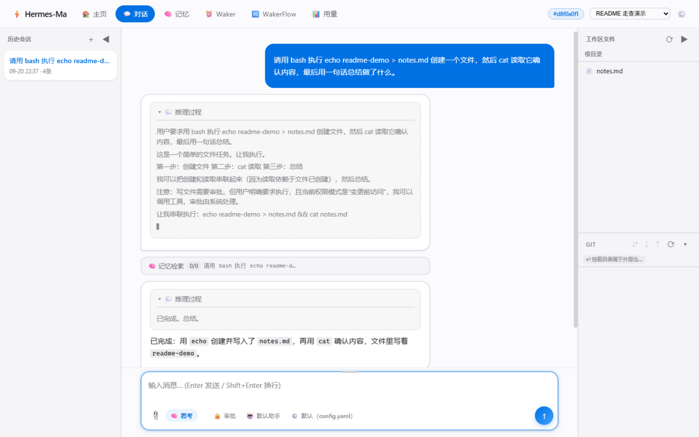

The right-side file tree (browse + click to preview; writes still go through the chat):

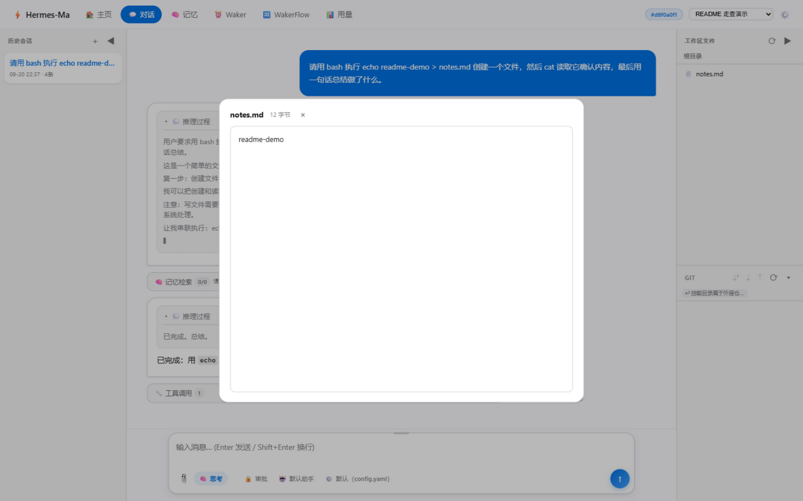

Destructive operations pop up full argument details first — approve or reject (HITL):

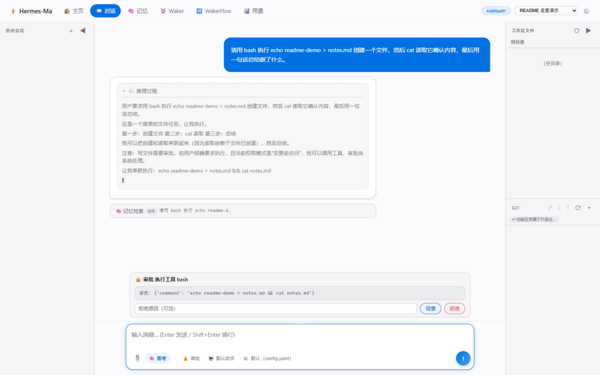

Confirm modal for delete-style actions (uiConfirm component, replaces native confirm):

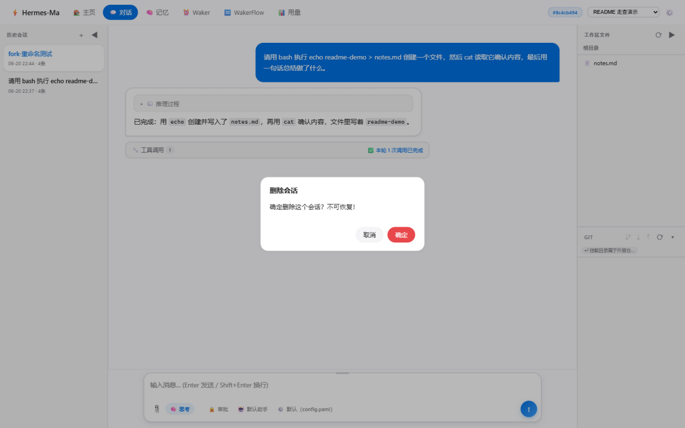

> ⚠️ **Security boundary (honest disclosure)**: there is no OS-level sandbox. The constraints are the tool-layer path guards + three-layer permissions (destructive operations go through HITL approval) + a tightened shell whitelist. Bash is only cwd-anchored at the project root and can in theory `cd` out — keep valuable data under `before_changes` (default) or `plan` mode.

### Session management (built into the chat sidebar)

History sessions live in the chat page's left sidebar: each entry supports **✏️ rename / 🗑 delete**, plus a "⋯" menu —

- **📋 Copy branch**: fork the session to continue, inheriting the project binding
- **📜 Event stream**: every persisted event of the session (turn/user/assistant/tool/interrupt/compact…, including HITL approval resume trails)
- **📝 Summarize**: distill the session into memory on demand

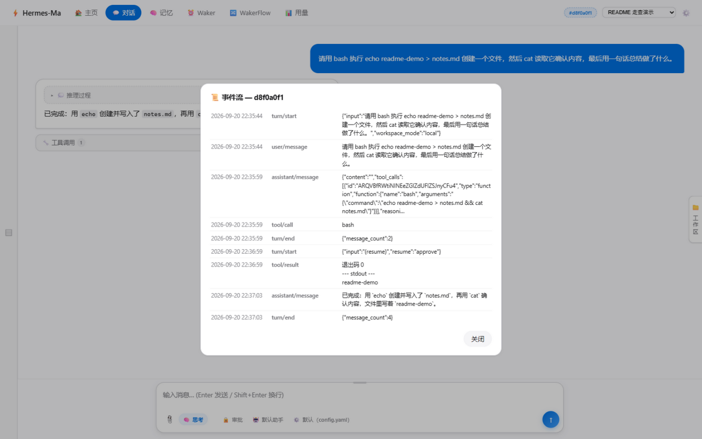

### Other pages

- 🧠 **Memory**: view / clear / LLM consolidation (dedup & merge, with snapshot backup & restore)

  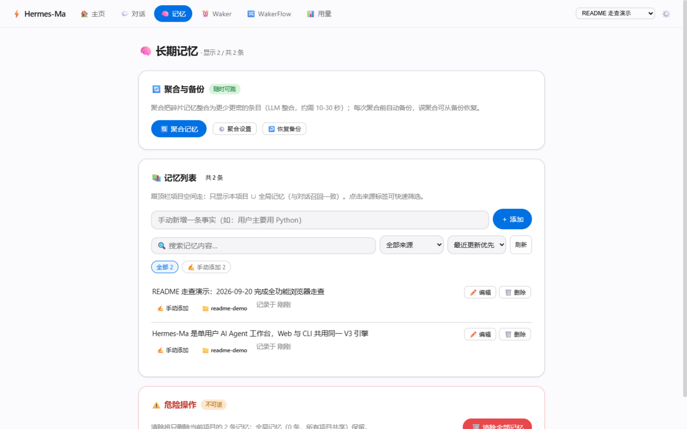
- ⚙️ **Settings**: preferences (hot-applied) + system config (masked keys are never written back) + model profiles + MCP management + run statistics + health check (shows version & code dir)

  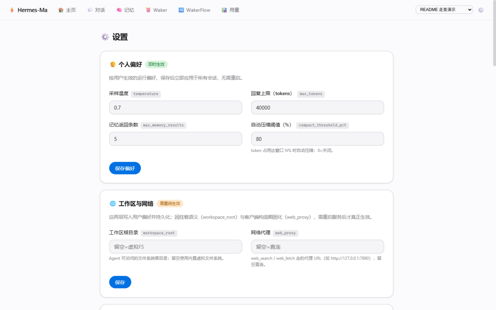

  Run-statistics snapshot (sessions / LLM errors / storage rows / waker overview):

  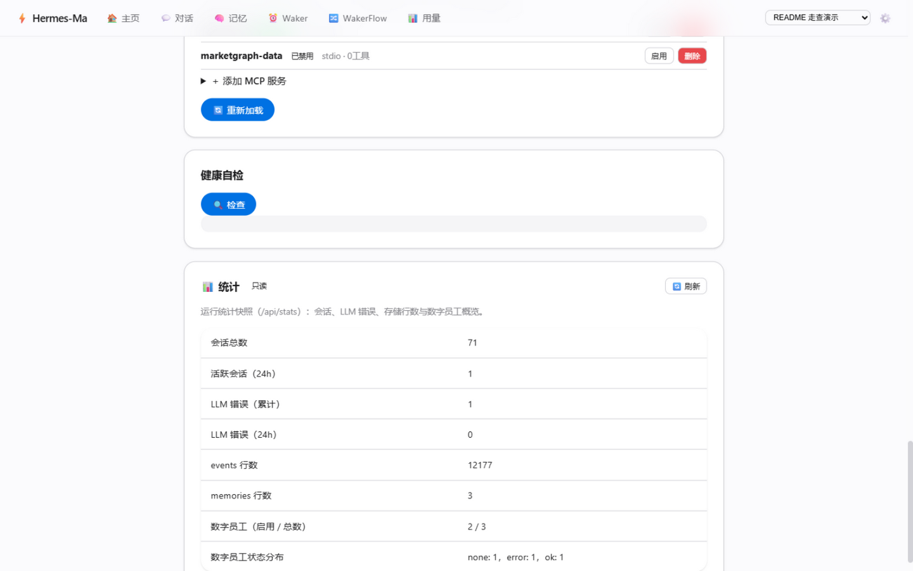
- 📊 **Usage**: LLM token accounting & dashboard — time-window & model filters, stacked daily trend (solid = input · light = output), per-scenario totals (chat/Waker/Flow), per-call details with tool/duration/retained records

  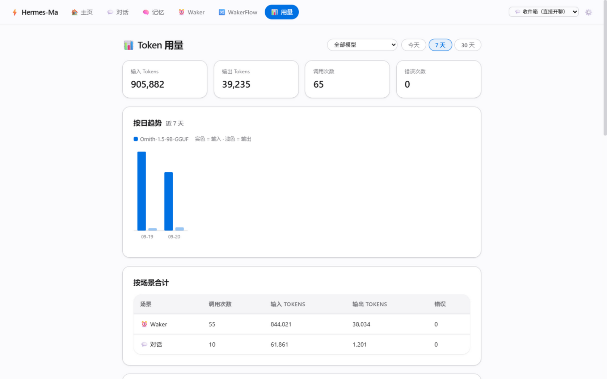
- ⏰ **Waker** / 🔀 **WakerFlow**: digital worker & workflow management (dedicated sections below)

## 📖 CLI Usage

```bash
python main.py
```

Single user (identity is always `local`); the startup banner shows the effective tool count and workspace mode.

| Command | Description |
|---------|-------------|
| `/project` | Project spaces: list / `switch <slug>` / `new <name>` / `off` back to the inbox (activation state shared with the Web) |
| `/events [n]` | Inspect the event-sourced trajectory of the current session |
| `/fork [event-id]` | Copy the current session into a branch (optionally truncated at an event id) and switch to it |
| `/think [on\|off]` | Toggle thinking mode (aligned with the Web reasoning chip) |
| `/waker [list\|run <name>]` | Digital workers: list / run one round immediately |
| `/flow [list\|run <name>]` | WakerFlow: list / run a workflow once |
| `/mode` | View/switch permission mode (full_access / before_changes / plan) |
| `/resume` `/resume <id>` `/resume -a` | Resume history sessions (waker persona binding restored with the session) |
| `/rename <name>` `/save` | Rename / manually save the current session |
| `/tools` `/skill` `/mcp` | Effective tools / skill list / MCP server management |
| `/memory` `/clear` | View / clear long-term memory |
| `/compact` `/reset` | Manually compact history / reset session (todos & workspace state cleared too) |
| `/help` `/exit` | Help / exit (optionally produce a session summary into memory) |

- **HITL approval**: the terminal prints the operation details; type `approve`, `reject:reason`, or any other text to reject (**bare Enter defaults to reject**)
- **Ctrl+C**: interrupts the current generation; generated content and your prompt are kept in the session history

## 🏗️ Architecture

### The Cordis plugin kernel (Python port)

Implemented after the Cordis meta-framework pattern from DeepSeek Harness (`src/cordis/`): **every capability is a plugin** attached to a shared Context, composed by one `cordis.yaml` manifest:

```yaml
plugins:
  - {id: config,    plugin: "src.plugins.config_plugin:apply"}
  - {id: storage,   plugin: "src.plugins.storage_plugin:apply"}
  - {id: sessions,  plugin: "src.plugins.sessions_plugin:apply", inject: [storage]}
  - {id: memory,    plugin: "src.plugins.memory_plugin:apply",   inject: [storage]}
  - {id: llm,       plugin: "src.plugins.llm_plugin:apply",      inject: [config]}
  - {id: tools,     plugin: "src.plugins.tools_plugin:apply",    inject: [config]}
  - {id: skills,    plugin: "src.plugins.skills_plugin:apply",   inject: [config]}
  - {id: mcp,       plugin: "src.plugins.mcp_plugin:apply"}
  - {id: workspace, plugin: "src.plugins.workspace_plugin:apply", inject: [storage]}
  - {id: schedule,  plugin: "src.plugins.scheduler_plugin:apply", inject: [config]}
```

Core mechanics: **Context = service registry** (stable keys like `ctx.tools` / `ctx.llm`); **declarative `inject`** (load order is derived automatically); **typed events** (four dispatch flavors — emit/waterfall/parallel/serial; the permission decision is a `tools/pre-execute` waterfall listener — deny short-circuits); **reversible registration** (teardown rolls back LIFO); **scopes** (waker runs use `ctx.scope()` for tool whitelists, replacing the old monkey-patching).

The agent loop itself is event-driven: `agent/pre-step` (memory injection / compaction / mode guidance are listeners) → `agent/request` → `llm/stream` → `tools/*` → `agent/turn-stopping`.

### Event-sourced sessions

Every turn is written to an append-only event log (SQLite `events` table): `turn/start`, `user/message`, `assistant/message` (with full tool_calls), `tool/call|result`, `interrupt/requested|resolved` (HITL interruption snapshots — **pending approvals survive worker restarts**), `compact/applied` (with a preserved zone), `turn/end`.

**Invariant**: the `derive_messages()` projection == the messages actually sent to the LLM ("whatever the model saw can be rebuilt from the log", locked by tests). Session loading prefers events, with legacy JSON snapshots as a compatible fallback. Dangling HITL tool_calls get placeholder synthesis during projection.

**Session state & cold archive**: the authoritative source for todos / virtual_fs / waker is a SQLite kv row (scope=`session_state`, one per session); the JSON snapshot is demoted to a rebuildable list-preview cache (legacy sessions backfill the kv on first read). A housekeeping task archives events before the last `compact/applied` into a sidecar `.events-archive.jsonl` (projection semantics unchanged; the event dialog / fork / `/events` read a merged cold+hot view).

### Storage & directories

Single SQLite database `data/hermes.db` (WAL, cross-process safe): `memories` / `events` / `kv` (active project pointer, mount state, task ledger, run registry, session state todos/vfs/waker) / `snapshots` (consolidation backups, rolling 10) + `projects` (project-space table, schema v2).

```
data/
  hermes.db        # SQLite (the data classes above)
  sessions/        # session JSON snapshots (list/preview cache; truth = event stream for messages, kv for todos/vfs/waker; *.events-archive.jsonl = cold event archive)
  projects/spaces/ # managed project workspaces (git clones / new spaces live here)
  summaries/       # session summary markdown
  uploads/         # chat images
  home/            # agent home (root of fs tools when nothing is mounted)
    wakers/ wakerflows/ ...
```

### Process model (multi-slot)

FastAPI main process (cordis ctx + unified scheduler + task ledger + direct-read routes) + **session-affine worker slots**: the default slot `main` hosts miscellaneous ops; every "currently generating" session gets its own worker subprocess (stdin/stdout NDJSON, runs the full agent) with no lock contention — this is how multi-tab parallelism works. Capped by `web_max_parallel_sessions` (default 3) with a friendly error when full. Waker/flow nodes and git clones fork independent subprocesses, never blocking the foreground chat.

### Security model

1. **Path guards**: every fs tool goes through `resolve_under_root` (realpath containment check) plus mount-root consistency validation (junction re-root defense)
2. **Three-layer permissions**: Layer3 parameter-level evaluator/regex overrides (force_deny hard floor) → Layer2 mode decision → tool execution
3. **HITL approval**: destructive operations interrupt for a human; sub-agents inherit the parent's permission mode and whitelist (no bypass path)
4. **Shell tightening**: whitelist commands + any redirect/file-writing shape requires approval; blacklist covers Windows path shapes
5. **Web boundary**: **no authentication** — binds to 127.0.0.1 by default with a loud warning on non-loopback listeners; no API auth whatsoever, so do not expose it to untrusted networks

## 🧑‍💼 Digital Workers (Waker)

A waker = independent persona + config + schedule. When due (or triggered via API) it runs a full agent round, with results written to `latest_result.md` + a `runs/<run_id>.jsonl` event stream. Storage: `data/home/wakers/<name>/`.

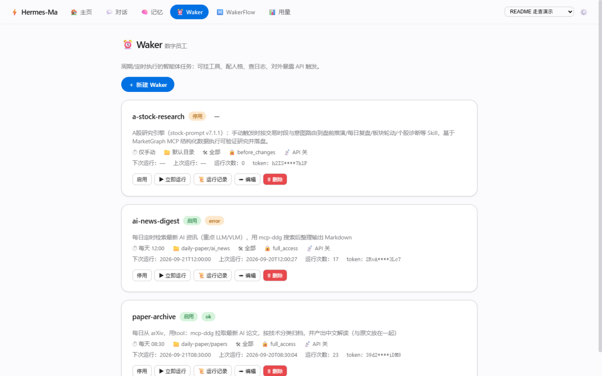

### waker.yaml configuration

The directory holds three persona markdown sections (IDENTITY/PERSONA/BIBLE, assembled in order into the system prompt) + `waker.yaml` (`config:` user-editable / `state:` written back by the scheduler, persisted in separate sections).

**Main `config:` fields**:

| Field | Default | Description |
|-------|---------|-------------|
| `enabled` | false | Enable scheduling |
| `tools` | [] | Tool whitelist (**empty = all**; scope-based, includes MCP after resolution) |
| `permission_mode` | before_changes | full_access / before_changes / plan |
| `task_prompt` | "" | Automatic task description (scope/steps/output location/success criteria) |
| `schedule_type` | interval | interval / daily / none (with `interval_minutes`, `daily_at`) |
| `api_enabled` + `api_token` | false | API trigger (token generated at creation, plaintext shown once) |
| `max_runs` / `expire_at` | 0 / "" | Run cap / expiry (0 = unlimited) |

**`state:`**: `run_count` / `last_run_at` / `last_status` / `next_run_at` (when the schedule falls behind, the card shows an "overdue" badge).

The create/edit form assembles the IDENTITY / PERSONA / BIBLE persona sections into the system prompt:

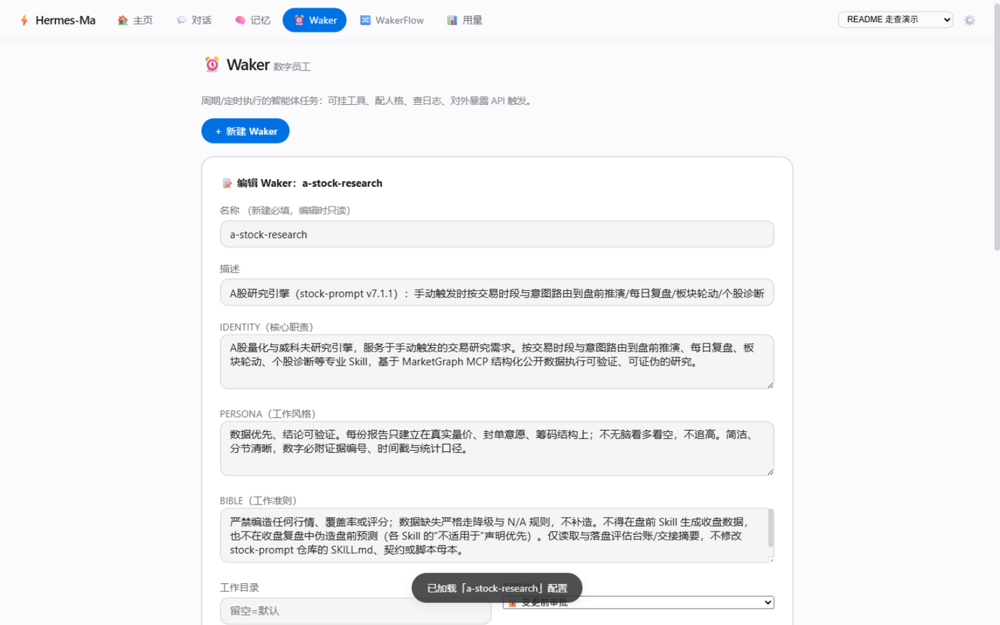

The "📜 run history" drawer: per-run status/duration/event stream and the final summary, one click away:

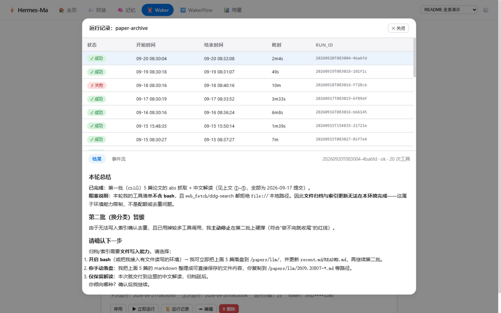

### Execution

- A unified scheduler service (`ctx.schedule`, one daemon thread hosting the waker/flow/memory-consolidation registrations) submits due jobs
- Execution runs in an **independent subprocess** (`worker_node`), never touching the chat execution slots; the tool whitelist/permission mode is passed via the `stream_invoke(allowed_tools=...)` scope
- Unattended approvals: under `before_changes` the run auto-rejects and records it (interrupt/resolved events); for full autonomy use `full_access`, or make approval points explicit with WakerFlow's `ask_user`

## 🧩 WakerFlow orchestration

A YAML-declared DAG: top-level ordered `steps`, each step nestable. A single waker is the degenerate case of a WakerFlow.

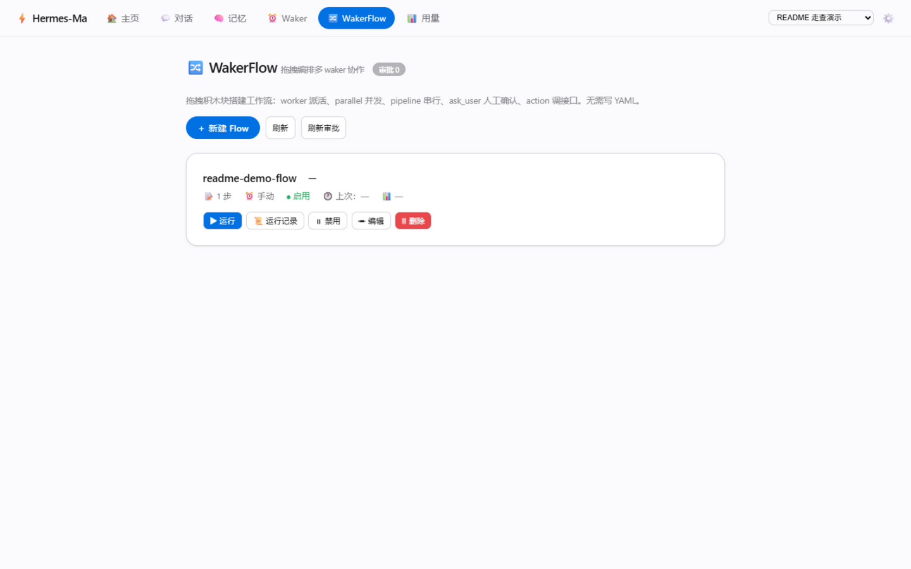

The web editor is a drag-and-drop block board (worker/parallel/pipeline/ask_user/action) — no YAML writing needed, with one-click YAML round-trip:

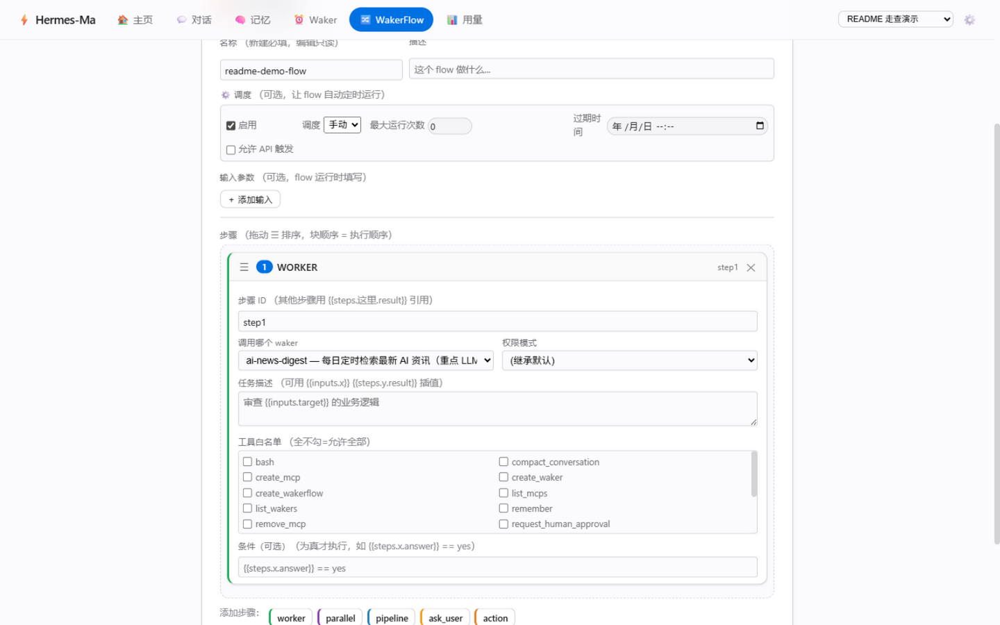

```yaml
name: repo_inspect
inputs:
  repo_path: {type: string, required: true}
steps:
  - id: scan
    worker: code_scanner
    task: Scan {{inputs.repo_path}}, list the tech stack and suspicious dependencies
  - id: analyze
    parallel:
      - {id: research, worker: tech_researcher, task: Research {{steps.scan.result}}}
      - {id: critique, worker: critic, task: Find risks in {{steps.scan.result}}}
  - id: ask_route
    if: inputs.mode == "deep"
    ask_user: {question: Go deeper?, options: [...], default: report, timeout: 3600}
  - id: notify
    action: {method: POST, url: https://hooks.example/x, body: {repo: "{{inputs.repo_path}}"}}
returns:
  summary: "{{steps.analyze.sub_results.research.result}}"
```

| Node | Semantics |
|------|-----------|
| `worker` | fork a subprocess running a waker persona's full agent, take the final text |
| `parallel` | concurrent sub-steps (shared context snapshot), aggregated into `sub_results` |
| `pipeline` | serial; upstream result enters context for downstream `{{steps.x.result}}` |
| `ask_user` | approval file + polling (answered on the Web approval page); `default` on timeout |
| `action` | HTTP callback (2xx → ok) |

- **Templates**: `{{inputs.x}}` / `{{steps.y.result}}` / `{{steps.parent.child.result}}` (missing keys raise, never silently empty)
- **`if`**: ast-whitelisted safe evaluation (GitHub Actions semantics), defaults to True on failure
- **YAML import/export**: one-click conversion in the Web editor (non-persistent conversion endpoint)
- **Audit**: `runs/<run_id>.jsonl` full events; the run registry lives in SQLite (visible after restart, running→interrupted)

## ⚖️ CLI vs Web

| Dimension | CLI | Web |
|-----------|-----|-----|
| Engine | HermesAgentV3 (same engine) | HermesAgentV3 |
| Project/workspace | `/project` switch/create/back-to-inbox (activation state shared with the Web; banner shows it honestly) | welcome-page project picker + right-side file tree |
| Parallel sessions | single session | multi-tab parallel generation (configurable cap) |
| HITL approval | terminal prompt (bare Enter = reject) | modal approve/reject |
| Permission mode | `/mode` | top-bar switch (synced across all instances) |
| Thinking mode | `/think on\|off` | reasoning chip |
| Session trajectory | `/events` event stream + `/fork` branches (same event sourcing) | event stream + fork + page management |
| waker/wakerflow | `/waker` `/flow` (list + run; CRUD via config files or the Web) | dedicated management pages (CRUD/trigger/approve/block editor) |
| MCP | `/mcp` menu | settings page, hot reload |

## 🧰 Tool surface (16 built-in + dynamic MCP)

| Class | Tools |
|-------|-------|
| Files / Shell | `bash` (the only file channel; cwd anchored at the project root; load the `file-ops` skill on demand. Whitelisted read-only commands auto-run; `sed -i` / redirects need approval. Not an OS sandbox: a whitelisted command can silently read paths outside the workspace — the real constraints are classification + HITL + the system prompt) |
| Orchestration | `task` (sub-agent, inherits permissions & whitelist) `compact_conversation` `write_todos` |
| Knowledge | `web_fetch` `web_search` `use_skill` `remember` `request_human_approval` |
| Management | `list_wakers` `create_waker` `set_waker_enabled` `create_wakerflow`; `list_mcps` `create_mcp` `remove_mcp` |
| MCP | `mcp__<server>__<tool>` (declared under `mcp_servers/` or added in-chat via `create_mcp`, hot-reloaded; visible in inbox via the `mcp__*` prefix; `trust=approval` still prompts) |

Inbox (project-less) mode keeps todos/compact + the waker/MCP management tools + `web_fetch`/`web_search`/`use_skill` + connected MCP tools (configurable via `workspace_chat_only_tools`).

**Self-evolve trio** (`self_backup` / `verify_self` / `respawn_self`): **not injected by default** — flip the `self_evolve_enabled` switch on the settings page and they appear from the next turn (same gating chain as `shell_enabled`); the force_approval guard for writing repo paths is unconditional and unaffected by the switch.

## 📁 Project structure (core)

```
hermes_ma/
├── main.py / src/cli/             # CLI entry (Rich; commands/render/chat_loop/entry package)
├── web_fastapi/                   # Web: app factory + multi-slot worker (process/ops/state modules) + routers + services layer + templates/JS
├── cordis.yaml                    # plugin manifest (10 lines = the whole capability surface)
├── config.yaml                    # LLM/ports etc. (env vars override)
├── src/
│   ├── cordis/                    # plugin kernel (Context/events/inject loader)
│   ├── types/                     # cross-package shared types (ToolResult/ToolSpec/PermissionDecision/InterruptSignal)
│   ├── plugins/                   # 10 plugins + boot_context composition root
│   ├── agent/                     # HermesAgentV3 (event-driven ReAct) + SessionLog + HITL + stream consumer/listeners
│   ├── tools/                     # ToolSpec/three-layer permissions/path guards/16 tool executors
│   ├── memory/                    # memory (extraction/decision/consolidation/scheduling; SQLite + sqlite-vec + fastembed)
│   ├── scheduling/                # unified scheduler service (daemon thread for waker/flow/consolidation/housekeeping)
│   ├── waker/ wakerflow/          # digital workers + DAG orchestration
│   ├── workspace/                 # mount state service (validation matrix/zip protection)
│   ├── storage/                   # SQLite seams (three protocols) + projects/run registry/housekeeping/session-state kv
│   ├── session_store.py           # session persistence (atomic writes/events-first loading/project binding)
│   └── ipc.py                     # subprocess NDJSON plumbing
├── tools/*.yaml                   # 16 declarative tool definitions (+3 self_evolve tools behind a default-off gate)
├── skills/                        # skill packs (bring your own, see skills/README.md)
├── scripts/                       # migrate_to_sqlite one-off migration + legacy_memory_backend (file backend retired, migration-only)
└── docs/                          # adr/ + architecture.md + refactor-roadmap.md (governance roadmap) etc.
```

## 🧪 Tests

```bash
python -m pytest          # 2,000+ cases (kernel / storage / agent event loop / HITL persistence / waker / flow / web API / security / parallel slots / cross-process concurrency / IPC contract / event archive)
```

CI: GitHub Actions (`.github/workflows/ci.yml`) — ruff + the full pytest suite on every push / PR.

## 📚 More documentation

- `docs/architecture.md` — one-page architecture summary (topology / decision table / risk list / dependency discipline)
- `docs/refactor-roadmap.md` — structure-governance roadmap (P0–P3 complete; per-item anchors, invariants and deferrals)
- `docs/adr/` — architecture decision records (execution isolation / scheduling / task ledger / storage topology / project-space model)
- `docs/cordis/01-rollout.md` — upgrade / migration / dual-mode usage guide, known issues and candidates
- `docs/walkthrough/` — code walkthrough (some chapters predate the Cordis refactor; historical reference)
- `docs/v3/` — the V3 architecture series (written during the earlier toolschema branch; historical reference for architecture decisions — for the current state, trust this README)

## 📄 License

[MIT](LICENSE)
