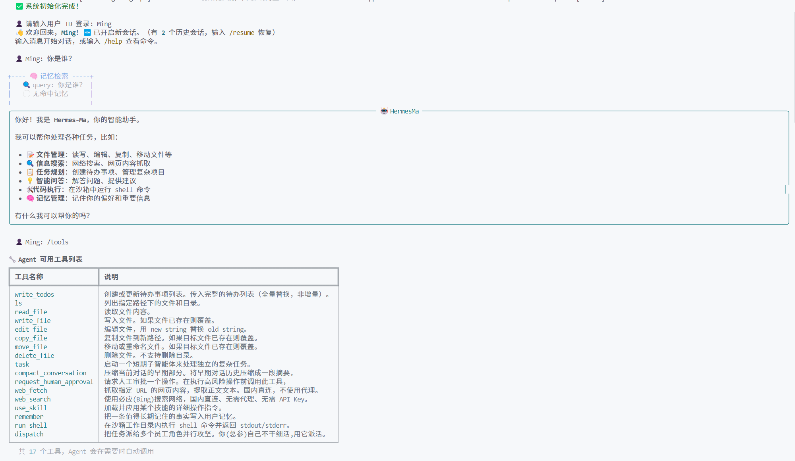
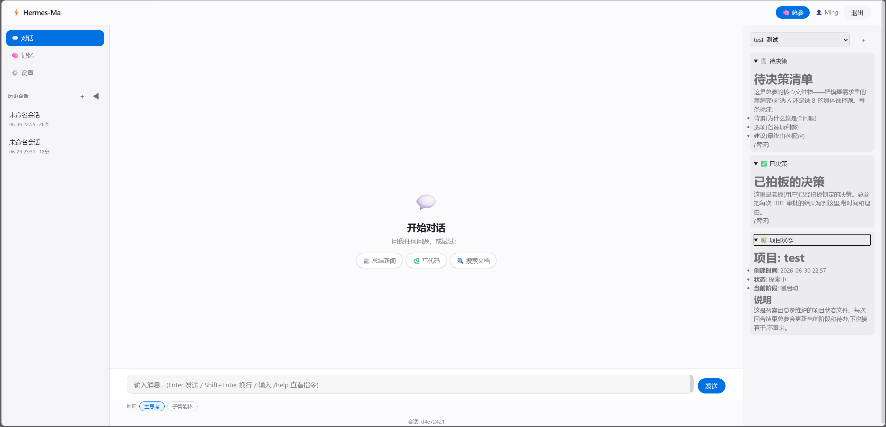
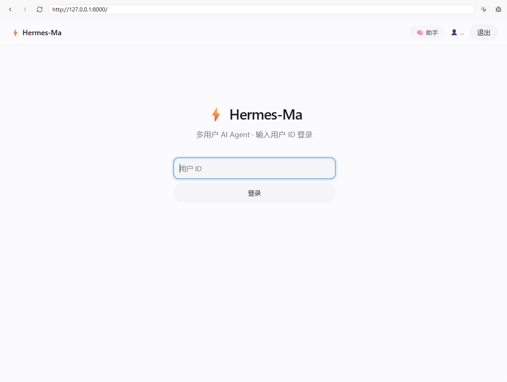
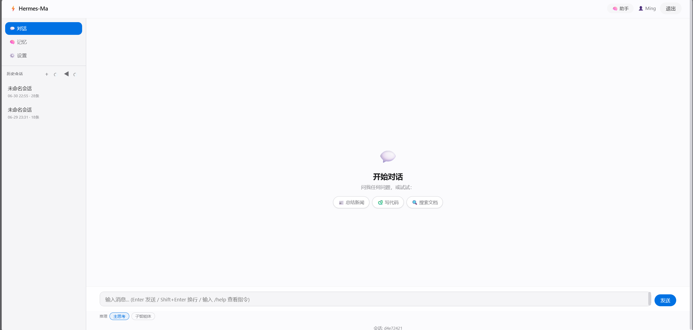
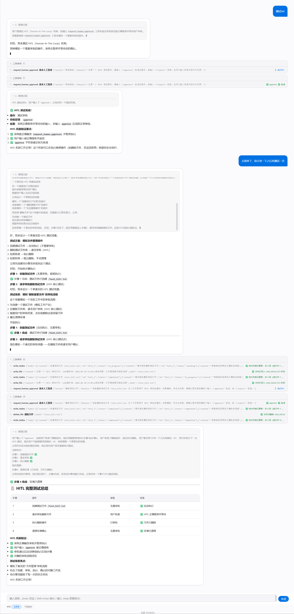

# ⚡ Hermes-Ma · Agent

> 暂未放出代码

Hermes-Ma 通过按钮切换，允许把"1 个被动聊天 agent"升级成"**半自主的 AI 智囊团**"：常驻一个总参（chief-of-staff），按需 fork 多个真员工 worker，通过**文件总线**协作，专把模糊需求拆解、围攻、整合，产出"你能拍板的具体决策清单"。用户只做最不可替代的拍板，最耗心智的"想清楚到底做什么"由智囊团承担。

底层基于 **LangChain + LangGraph**，记忆层为**纯文件后端**（已移除 Qdrant/Mem0 等向量库依赖），通过 CLI 或 Web（FastAPI，每用户独立进程）交互。

## 🖼️ 双界面一览

Hermes-Ma 提供两种交互界面，**同一个 Agent 内核**，两种使用姿势：

<!-- 截图：CLI 终端里的 Rich 多面板对话，左侧/上方能看到 tool 调用面板、Markdown 渲染 -->


<!-- 截图：Web 三栏布局——左侧会话列表、中间对话流、右侧（总参模式下的）待决策面板 -->


> 两者的详细区别见下方 [⚖️ CLI vs Web 区别](#-cli-vs-web-区别)。

## ✨ 核心特性

- 🎖️ **智囊团编排**：常驻总参拆解任务 → `dispatch` 工具并发 fork 员工 worker（调研员/探索员/质疑员…）→ 文件总线收活 → 整合 → HITL 递《待决策清单》
- 🤖 **真员工 worker**：员工 = 独立 OS 进程（不是阉割版 sub_agent），各自独立 LLM 客户端、各自角色卡，干完即弃
- 🧠 **角色系统（Roles）**：员工即文件（复用 skill 加载机制），三层优先级 `内置默认 < shared/roles/ < 用户私有 roles/`；招新员工 = 写个 md，不动代码
- 📁 **文件记忆（替代向量库）**：纯文件后端（`FileMemoryStore`）——`profile.md` + `projects/` 项目文档，透明可读、可 git、零基础设施依赖；`remember` 工具 LLM 自主存储，会话结束自动总结
- 🚌 **文件总线**：jsonl 原子写 + 进程崩溃可恢复，总参 ↔ 员工的通信传输层（task / result / heartbeat / approval_needed）
- 🔒 **多用户进程级隔离**：每用户独立 worker 子进程 + per-user workspace 分层（`users/<uid>/`）
- ⚡ **流式输出 + 推理拆分**：逐 token 打字机；推理思考自动拆成 reasoning / content 两路分别渲染（适配 vLLM/Qwen3 两种输出格式——`delta.reasoning` 独立字段 + `<think>` 内联标签，含 LangChain 丢字段 monkeypatch 兜底）
- 🔧 **工具调用**：17 个内置工具（文件系统 7 个、shell 执行、子智能体、网络搜索/抓取、技能/角色加载、记忆、人工审批、上下文压缩、派活 dispatch）+ MCP 动态外部工具
- ✋ **人工审批（HITL）**：基于 LangGraph `interrupt`，高风险操作 / 非白名单 shell 命令前暂停等待确认
- 🎯 **技能系统（Skills）**：可插拔专家能力包（文件夹结构），兼容 Claude Code Skills / Cline Rules 等格式
- 🔌 **MCP 集成**：连接外部 MCP Server（stdio/sse/http），复用生态工具
- 🌐 **双界面**：CLI（Rich 多面板） + Web（FastAPI，多用户进程隔离 + per-user 配置热更新）
- 💾 **会话持久化 + 启动恢复**：对话历史、待办、文件系统自动保存；总参重启读 `.bus/` + `META.md` 接续上次进度

## 🚀 快速开始

### 1. 前置条件

- Python 3.10+
- LLM API Key（OpenAI / DeepSeek / Qwen / 其他兼容 API，含本地 vLLM/Ollama）

> ℹ️ **无需 Docker / 向量数据库**。记忆层已改为纯文件后端（`FileMemoryStore`），不再依赖 Qdrant。早期版本需要的 `docker compose up -d` 启动 Qdrant 步骤已移除。

### 2. 配置

```bash
# 复制模板为 config.yaml（唯一真相源）
cp config.example.yaml config.yaml

# 编辑 config.yaml，填入你的 API Key 和模型配置
# 环境变量（大写下划线）可覆盖 yaml 同名键
```

**使用 OpenAI：**
```yaml
openai_api_key: "sk-your-actual-key"
openai_base_url: "https://api.openai.com/v1"
llm_model_name: "gpt-4o"
```

**使用 DeepSeek / Qwen：**
```yaml
openai_api_key: "sk-your-deepseek-key"
openai_base_url: "https://api.deepseek.com/v1"
llm_model_name: "deepseek-chat"
```

**使用本地 vLLM / Ollama：**
```yaml
openai_api_key: "ollama"
openai_base_url: "http://localhost:11434/v1"
llm_model_name: "qwen2.5"
```

**（推荐）开启文件工作空间（智囊团必需）：**
```yaml
# 智囊团的项目文件 / 文件总线 / per-user 隔离都依赖真实文件系统
workspace_root: "D:/path/to/hermes-workspace"
```

**（可选）开启 Shell 执行器：**
```yaml
shell_enabled: true                 # 默认关闭，opt-in
shell_allowed_commands: "ls,cat,grep,git,find,wc,..."  # 白名单自动放行
```

**（可选）配置 MCP 服务器：**
```bash
cp mcp_servers.example.yaml mcp_servers.yaml
# 编辑 mcp_servers.yaml 添加 MCP server（格式参考 Claude Desktop）
```

### 3. 安装依赖

```bash
pip install -r requirements.txt
```

> ℹ️ `requirements.txt` 是权威安装清单（含 Web 依赖 `fastapi/uvicorn/jinja2` 等）。`pyproject.toml` 的 `[project].dependencies` 只列 CLI/运行时依赖，单独 `pip install -e .` 不足以跑起 Web。

### 4. 启动 Hermes

两条命令二选一，详见下方对应章节：

```bash
# A) CLI 模式（终端 Rich 交互）
python main.py

# B) Web 模式（FastAPI，浏览器多用户，推荐用于多用户/展示）
python -m web_fastapi.main
# 浏览器打开 http://127.0.0.1:8000
```

调试模式（输出详细日志 / Web 热重载）：
```bash
python main.py --debug              # CLI
python -m web_fastapi.main --debug  # Web
```

## 📖 CLI 使用说明

CLI 是单进程、单用户、终端内的交互式 REPL，适合个人本地使用、ssh 远程、调试日志方便。启动后会先做 LLM 连通性自检，然后提示输入用户 ID 登录：

<!-- 截图：CLI 启动画面——Logo 面板 + 自检 ✅ LLM API 连通性 正常 + 👤 登录提示 -->


```
⚡ Hermes-Ma · AI 智囊团 Agent
   常驻总参 · 文件总线 · 文件记忆

  ✅ LLM API 连通性 正常

  👤 请输入用户 ID 登录: alice
  👋 欢迎回来，alice！🆕 已开启新会话。
```

登录后进入对话循环：直接输入内容即与 Agent 对话（流式打字机输出），输入 `/` 开头的斜杠命令执行内置功能。回复过程中按 `Ctrl+C` 可中断生成（已生成内容保留）。

<!-- 截图：CLI REPL 对话——Rich 多面板，含 AI 回复面板、工具调用面板、Markdown 渲染 -->


### 内置命令

| 命令 | 说明 |
|------|------|
| `/switch <用户ID>` | 切换当前用户（保存当前会话，开启新会话） |
| `/resume` | 显示历史会话列表（分页，n/p 翻页），选择恢复 |
| `/resume <会话ID>` | 直接恢复指定历史会话 |
| `/resume -a` | 恢复会话并显示全部历史消息（不限 3 条） |
| `/rename <名称>` | 重命名当前会话 |
| `/skill` | 列出所有可用技能（只读，标记来源 + 资源数） |
| `/mcp` | 管理 MCP 服务器（交互菜单：列表/启用/禁用/删除） |
| `/memory` | 查看当前用户的所有长期记忆 |
| `/clear` | 清除当前用户的所有长期记忆（需确认） |
| `/tools` | 列出 Agent 可用的所有工具 |
| `/compact` | 手动压缩对话历史（早期消息转为摘要） |
| `/reset` | 重置当前会话（清空对话历史，开启新会话） |
| `/save` | 手动保存当前会话 |
| `/help` | 显示帮助信息 |
| `/exit` | 退出 Hermes（自动保存会话 + 关闭 MCP 连接） |

### 人工审批（HITL）

当 Agent 要执行高风险操作、或 `run_shell` 遇到非白名单命令时，会暂停并弹出终端确认提示，你 `approve` / `reject` 后才会继续：

<!-- 截图：CLI 的 HITL 审批提示——工具名 + 待执行内容 + approve/reject 选择 -->


## 🌐 Web 使用说明

Web 端（`web_fastapi/`）是浏览器内的图形界面，**每用户独立 worker 子进程**，支持真多用户、跨设备访问，适合多人使用或对外展示。前端是 Apple 极简风的 Jinja2 模板 + 原生 JS，无构建链。

### 1. 启动

```bash
python -m web_fastapi.main
# 启动后会打印两个访问地址：
#   http://127.0.0.1:8000   ← 本机访问
#   http://<局域网IP>:8000   ← 局域网/跨设备访问
```

- **监听地址**：默认 `0.0.0.0`（局域网可达）。覆盖方式优先级：环境变量 `WEB_HOST` → `config.yaml` 的 `web_host` → 默认 `0.0.0.0`。设 `127.0.0.1` 则仅本机可访问。
- **端口**：当前写死 `8000`（`web_fastapi/main.py`）。`config.yaml` 里虽有 `web_port` 键但**暂未被代码读取**，改端口需动代码或上反向代理。
- **`--debug`**：启用 uvicorn 热重载，改完前端/后端代码自动刷新。
- Windows 浏览器访问不了 `0.0.0.0`，所以启动日志会同时给出 `127.0.0.1` 和局域网 IP 两个地址。

### 2. 登录与多用户

<!-- 截图：Web 登录页——简洁输入框，输入用户 ID 即进入 -->


- 登录页输入一个用户 ID 即进入（**无密码**，面向本机/可信局域网设计）。
- 多标签 / 同浏览器不同用户：每个浏览器标签的 `sessionStorage` 独立存 `X-User-Id`，可同时登录多个用户互不串扰。
- **每用户一个独立 worker 子进程**：LLM 客户端、记忆、会话状态全部进程级隔离，FastAPI 主进程不持有任何 Agent 状态。
- 生命周期：登录即 fork worker，登出或**空闲 30 分钟**自动回收；FastAPI 进程退出时所有 worker 一并关闭。

> ⚠️ **安全提醒**：默认签名 cookie 的 `WEB_SECRET_KEY` 是弱口令（`hermes-dev-secret-change-me`），用户 ID 仅靠签名 cookie / `X-User-Id` 头识别。**面向公网 / 不可信网络部署前务必**设置强 `WEB_SECRET_KEY` 环境变量并补一层认证。

### 3. 界面功能

<!-- 截图：Web 三栏主界面——左侧会话历史列表、中间对话流(含流式打字)、底部输入框 -->


- **三栏布局**：左侧会话历史（新建 / 加载 / 行内重命名 / 删除），中间对话流，右侧**仅总参模式**出现的待决策面板。
- **SSE 流式**：正文 token、推理 token、工具开始/结束、子智能体 token 全部实时滚动推送。
- **每条消息开关**：发送前可独立勾选「主推理」/「子智能体推理」是否展示。
- **Markdown 渲染**：`marked.js` + `highlight.js` 代码高亮 + 每个代码块复制按钮 + 手写 XSS 过滤（剥离 `<script>` / `on*` 事件）。
- **总参模式 toggle**：前端一个开关切换 chief-of-staff 模式（不 spawn 新 agent，只换系统提示 + 显右侧决策面板）。

<!-- 截图：Web 总参模式——右侧出现「待决策清单 / open-questions」面板 -->


- **人工审批（HITL）**：工具要审批时弹出页面内模态框，`approve` / `reject` + 理由后流式续上：

<!-- 截图：Web HITL 审批模态框——工具名 + 待执行内容 + approve/reject 按钮 -->


- **内置斜杠命令**（前端拦截，CLI 子集）：`/help` `/reset` `/compact` `/save` `/tools` `/skills` `/memory` `/config`。

<!-- 截图：Web 会话侧边栏——会话列表、新建按钮、重命名/删除操作 -->


- **独立页面**：会话页（`/sessions`）、记忆页（`/memory`）、配置页（`/config`，支持 per-user 配置热更新 + 角色 toggle + LLM 模型覆写）。

## ⚖️ CLI vs Web 区别

两者**共用同一个 Agent 内核**（`HermesAgent` + `MemoryManager` + LangGraph 图 + 同一套 17 个工具），差别在交互外壳和并发模型：

| 维度 | CLI（`python main.py`） | Web（`python -m web_fastapi.main`） |
|------|------------------------|--------------------------------------|
| 交互外壳 | 终端 Rich 多面板 REPL | 浏览器三栏 UI |
| 并发模型 | 单进程、单用户、阻塞循环 | **每用户独立 worker 子进程**，真多用户 |
| 用户身份 | 启动提示输入一次，`/switch` 切换 | 登录页输入，多标签可同浏览器多用户 |
| 进程间通信 | 直接 Python 函数调用 | FastAPI ↔ 子进程 stdin/stdout NDJSON IPC，再 SSE 推浏览器 |
| 流式渲染 | Rich console 实时渲染事件 | SSE 推送，浏览器逐 token 滚动 |
| HITL 审批 | 终端提示确认 | 浏览器模态框 + `/api/chat/approve` SSE 续上 |
| 斜杠命令 | 全套（14 条） | 子集（8 条，前端拦截） |
| Markdown 渲染 | Rich Markdown | marked.js + 代码高亮 + 复制按钮 |
| 总参模式 | 需靠命令/配置切 | 前端 toggle 一键切 + 右侧决策面板 |
| 会话/记忆管理 | 斜杠命令 | 独立页面（会话页/记忆页/配置页） |
| 配置热更新 | 改 yaml 需重启 | 配置页 per-user 在线改 |
| 适用场景 | 个人本地、ssh、调试日志顺手 | 多用户、图形界面、对外展示、跨设备 |

**怎么选？**
- **自己用 / 服务器 ssh / 调试时想看完整日志** → CLI
- **多人用 / 要好看 / 对外演示 / 跨设备访问** → Web

> 📦 Web 端的 worker 子进程复用了 CLI 的 `save_session` / `load_session` 等持久化函数（`web_fastapi/worker_process.py` 调 `from src.cli import save_session`），数据格式与 CLI 完全互通——同一用户在 CLI 保存的会话，Web 端也能看到、加载。

---

> 以下章节为深度内容（设计原理、内部结构），想先跑起来的读者可以跳过，回头按需查阅。

## 📐 智囊团工作流

```
你 ──(对话/HITL 拍板)──▶ 总参 worker（常驻，role=chief-of-staff）
                          │
                总参调 dispatch(roles=[...], task=...) 工具
                          │ (工具内：并发 fork 到总线、并发收结果)
            ┌─────────────┼─────────────┐
            ▼ 文件总线 .bus/ ▼            ▼
      [调研员 worker]  [探索员 worker]  [质疑员 worker]
       (进程B,独立LLM) (进程C)          (进程D)
            │              │              │
       各自读 inbox       读 inbox        读 inbox
       干活写 outbox      写 outbox       写 outbox
            ▼              ▼              ▼
       research/      exploration/    critiques/   ← 角色产出 = 角色记忆(文件)
```

**星型协作**：员工只跟总参交接（经总线），不互相对话。

<!-- 截图：dispatch 实际跑起来的过程——能看到总参拆活 + 多个员工 worker 并发产出（CLI 或 Web 任一即可） -->


## 🎭 角色系统（Roles）

智囊团的「员工」（调研员 / 探索员 / 质疑员 / 总参…）**就是文件**——每个角色 = 一个文件夹 + 一个 `role.md`，**不动任何代码**。新增员工 = 写个 md，覆盖内置员工 = 同名放一份你自己的。

### 三层优先级

加载时后者覆盖前者同名（`RoleRegistry` 懒加载，重名时高优先级整个替换低优先级）：

| 层级 | 路径 | 作用域 |
|------|------|--------|
| 内置 | `shared/roles/<name>/role.md`（随软件发布） | 所有用户共享，不可改 |
| workspace 共享 | `<workspace_root>/shared/roles/<name>/role.md` | 所有用户共享（覆盖内置） |
| **用户私有** | **`<workspace_root>/users/<uid>/roles/<name>/role.md`** | **仅当前用户（最高优先级，覆盖上面两层）** |

> ⚠️ **用户私有角色依赖 `workspace_root`**。若 `config.yaml` 的 `workspace_root` 为空（走内存虚拟 FS），用户私有层和 workspace 共享层都会被跳过——自定义角色读不到。要自定义角色必须先配真实 `workspace_root`。

### role.md 格式

`frontmatter（YAML）+ 正文`，结构参考内置的 `shared/roles/researcher/role.md`：

```markdown
---
name: researcher
description: 调研员——把外部世界的已知信息搬回来
tools: web_search, web_fetch, read_file, write_file, ls
---

你是智囊团的**调研员**。总参给你一个调研任务，你的职责是把外部世界的事实搬回来。

## 工作原则
- 只摆事实，不臆测。每条结论都要有来源。
- 查不到就明说查不到，不要编。

## 产出
把调研笔记用 write_file 写到当前项目的 research/ 文件夹下。

## 你不是谁
- 你不拍板（那是老板的事）。
- 你不质疑合理性（那是质疑员的事）。
```

**frontmatter 字段**：

| 字段 | 必填 | 说明 |
|------|------|------|
| `name` | 否（缺省取文件夹名） | 角色唯一标识。总参 `dispatch(roles="researcher")` 和角色切换都认它 |
| `description` | 否（缺省取正文第一段） | 一句话描述，列角色时展示 |
| `tools` | 否（缺省 = 不限制） | **该角色允许用的工具名，逗号分隔的字符串**（不是 YAML 列表）。如 `web_search, read_file, write_file` |

**正文** = 去 frontmatter 后的完整指令，会注入到这个角色的 system prompt（总参模式改系统提示人格块；员工模式直接当员工 worker 的 prompt）。

> 💡 入口文件名优先级：`role.md` > 文件夹内唯一的 `.md` > 与文件夹同名的 `.md`。**推荐用 `role.md`**，跟 skill 的 `SKILL.md` 区分开，语义清晰。

### 完整示例：新增一个「撰写员」角色

假设当前用户是 `alice`，`workspace_root = D:/hermes-workspace`：

```
D:/hermes-workspace/
  users/
    alice/
      roles/
        writer/
          role.md          ← 新建这个文件
```

`writer/role.md`：

```markdown
---
name: writer
description: 撰写员——把零散结论整理成可读文档
tools: read_file, write_file, edit_file, ls
---
你是智囊团的**撰写员**。总参把员工们的产出交给你，你的职责是把它们整理成结构清晰、老板能直接看的文档。

## 工作原则
- 先 read_file 读完所有相关 research/exploration/critiques 产出。
- 输出落到 projects/<项目>/ 下，文件名贴切（如 方案草案.md）。
- 用 Markdown，标题分章节，关键结论加粗。

## 你不是谁
- 不调研（researcher 的事）、不质疑（critic 的事）。
```

写完后总参就能 `dispatch(roles="writer", task="...")` 派活了。

### 覆盖内置角色（而不是新增）

想改 `chief-of-staff`（总参）的行为？**同名覆盖**：在 `users/<uid>/roles/chief-of-staff/role.md` 放一份你改过的版本，它会**完全替换**内置那份。最简单的做法是把 `shared/roles/chief-of-staff/role.md` 复制过去改——比如让总参每次先读 `journal.md`、或让它更啰嗦 / 更精简。`researcher` / `explorer` / `critic` 同理。

### 让新角色立刻生效

`RoleRegistry` 是懒加载单例，新文件**不一定会立刻被扫到**（取决于是否触发了重扫）。最稳妥的生效方式：

- **CLI**：退出（`/exit`）重开，重新登录
- **Web**：登出再登录（触发 worker 子进程重建，会重新初始化 `RoleRegistry`）

验证是否加载成功：开 `--debug` 看日志，会打印 `已加载角色: <name> (user)`（`source=user` 说明读到的是你私有的那份）。

### 全局共享角色（可选）

如果你希望某个角色**所有用户都能用**（不是某个人私有），放 workspace 共享层：

```
<workspace_root>/shared/roles/<name>/role.md
```

它会覆盖软件内置的同名角色，但被各用户的私有同名角色再覆盖一层。

## 📁 项目结构

```
hermes_ma/
├── main.py                        # CLI 主入口
├── web_fastapi/                   # FastAPI Web 界面（推荐，多用户进程隔离 + 配置热更新）
│   ├── app.py                     #   FastAPI 应用工厂 + lifespan
│   ├── main.py                    #   启动入口（uvicorn）
│   ├── worker_manager.py          #   WorkerManager：user_id → worker 子进程池（每用户独立进程）
│   ├── worker_process.py          #   worker 子进程入口：跑完整 MemoryManager + HermesAgent
│   ├── ipc.py                     #   stdin/stdout NDJSON IPC 协议
│   ├── routers/                   #   API 路由（auth/chat/sessions/memory/system/mcp/config/projects）
│   ├── services/config_service.py #   per-user 配置热更新
│   ├── templates/                 #   Jinja2 模板（Apple 极简风）
│   └── static/                    #   CSS/JS/vendor（无构建链）
├── run_health.py                  # 健康检查独立脚本
├── config.py                      # 配置加载（yaml 唯一真相源 + 环境变量覆盖）
├── config.example.yaml            # 配置模板（复制为 config.yaml 后编辑）
├── mcp_servers.example.yaml       # MCP 服务器配置模板
├── shared/                        # 内置共享资源（随软件发布）
│   └── roles/                     #   共享角色卡模板（chief-of-staff / researcher / explorer / critic）
├── skills/                        # 技能目录（每个子文件夹 = 一个技能）
├── src/
│   ├── state.py                   # AgentState 定义（TypedDict + add_messages reducer）
│   ├── skills.py                  # SkillRegistry 技能注册与加载（文件夹结构 + frontmatter）
│   ├── think.py                   # 推理流式拆分（ThinkSplitter 状态机 + LangChain reasoning 字段 monkeypatch）
│   ├── prompts.py                 # System Prompt 模板（时间戳 + 记忆 + 技能目录 + 角色人格块）
│   ├── health.py                  # 启动自检模块
│   ├── logging_config.py          # 分层日志（info.log + error.log，按天滚动）
│   ├── exceptions.py              # 自定义异常
│   ├── cli.py                     # Rich CLI 交互界面
│   ├── cli_mcp_menu.py            # /mcp 命令交互菜单（MCP server 管理）
│   ├── thinktank/                 # 智囊团子系统（常驻总参 + fork 员工 + 文件总线）
│   │   ├── __init__.py            #   导出 Bus/dispatch/projects/roles 门面
│   │   ├── bus.py                 #   文件总线 Bus（jsonl 原子写 + 文件锁 + 心跳/结果消息）
│   │   ├── dispatch.py            #   dispatch 工具：fork 员工 worker + 轮询收结果 + 超时 + 启动恢复
│   │   ├── employee_worker.py     #   员工 worker 一次性进程（被 dispatch spawn，干完即弃）
│   │   ├── projects.py            #   项目管理：幂等创建骨架（META/decisions/open-questions/journal）
│   │   └── roles.py               #   RoleRegistry 角色注册与加载（复用 SkillRegistry 底层 + tools 字段）
│   ├── memory/                    # 自研记忆模块（纯文件后端，替代 Mem0/Qdrant）
│   │   ├── __init__.py            #   导出 MemoryManager 门面
│   │   ├── manager.py             # MemoryManager（组合 Store/Extractor/Decider）
│   │   ├── file_store.py          # FileMemoryStore（纯文件 CRUD，profile.md / 项目文件）
│   │   ├── extractor.py           # MemoryExtractor（LLM 提取原子事实）
│   │   ├── decider.py             # MemoryDecider（LLM 决策 ADD/UPDATE/DELETE/NOOP）
│   │   ├── summarizer.py          # Summarizer（会话结束总结）
│   │   ├── models.py              # Memory/Hit/Decision 数据模型
│   │   └── prompts.py             # 记忆模块专用 LLM 提示词
│   ├── agent/                     # Agent 核心模块
│   │   ├── graph.py               # HermesAgent（LangGraph StateGraph 编排 + HITL + 循环检测 + role 切换）
│   │   ├── tools_registry.py      # ToolRegistry 工具注册与调度（区别于 tools/ 工具实现包）
│   │   ├── context.py             # ContextManager 消息构建与上下文压缩
│   │   ├── memory_orch.py         # MemoryOrchestrator 记忆检索与存储
│   │   ├── session_lifecycle.py   # SessionLifecycle 会话结束总结 hook
│   │   └── tool_result.py         # ToolResult 统一返回协议
│   ├── mcp/                       # MCP 客户端模块（Model Context Protocol）
│   │   ├── config.py              # McpServerConfig + McpConfigManager
│   │   ├── client.py              # McpClientManager 连接管理（全局单例）
│   │   └── adapters.py            # MCP 工具 → LangChain BaseTool 适配
│   └── tools/                     # 工具实现（17 个内置）
│       ├── __init__.py            # BUILTIN_TOOLS + get_all_tools()（内置+MCP）
│       ├── write_todos.py         # 任务规划工具
│       ├── virtual_fs.py          # 文件系统工具（真实/虚拟双模式，7个工具，per-user 分层）
│       ├── run_shell.py           # Shell 命令执行（白名单自动放行 + 其余 HITL 审批）
│       ├── shell_safety.py        # Shell 命令分类（白名单/黑名单/危险模式）
│       ├── remember.py            # 主动记忆工具（LLM 自主存储事实）
│       ├── sub_agent.py           # 子智能体工具
│       ├── compact.py             # 上下文压缩工具
│       ├── human_approval.py      # 人工审批工具（LangGraph interrupt 机制）
│       ├── use_skill.py           # 技能加载工具
│       ├── web_fetch.py           # 网页抓取工具
│       └── web_search.py          # 网络搜索工具
├── tests/                         # 测试（记忆模块 / 虚拟FS / subagent / contextvars / 日志 / web_fastapi）
├── logs/                          # 运行时日志（自动创建，.gitignore 忽略）
└── data/                          # 运行时数据（自动创建，.gitignore 忽略）
    └── sessions/                  # 会话持久化 JSON
```

### 工作空间目录结构（多用户 + 智囊团）

配置 `workspace_root` 后，文件工具 / shell / 记忆 / 项目全部落在这棵文件树下，按 `users/<uid>/` 物理隔离：

```
<workspace_root>/
  users/
    <user_id>/                        ← 每用户沙箱根（物理隔离）
      profile.md                      ← 用户画像（remember 产出）
      roles/                          ← 用户私有角色（最高优先级，覆盖 shared）
      projects/
        <项目>/
          META.md                     ← 项目状态/断点（总参每次更新，启动恢复读它）
          decisions.md                ← 已拍板的决策
          open-questions.md           ← 待决策清单（总参核心交付物）
          journal.md                  ← 探索时间线
          .bus/                       ← 文件总线（jsonl，韧性根基）
            chief-of-staff/{inbox,outbox}.jsonl
            researcher/{inbox,outbox}.jsonl
            ...
          research/                   ← 角色产出 = 角色记忆
          exploration/
          critiques/
  shared/
    roles/                            ← 全局共享角色模板（所有用户可用，随软件发布）
```

## 🔧 工具列表

Agent 拥有 **17 个内置工具**，加上通过 MCP 动态加载的外部工具：

| 工具 | 说明 |
|------|------|
| `write_todos` | 创建/更新待办事项列表（全量替换） |
| `ls` | 列出目录中的文件 |
| `read_file` | 读取文件内容 |
| `write_file` | 写入或创建文件 |
| `edit_file` | 编辑文件（字符串替换） |
| `copy_file` | 复制文件到新路径 |
| `move_file` | 移动或重命名文件 |
| `delete_file` | 删除文件 |
| `run_shell` | 在 workspace 内执行 shell 命令（白名单自动放行 + 其余 HITL 审批，默认关闭） |
| `task` | 启动子智能体执行隔离任务 |
| `dispatch` | **智囊团派活**：并发 fork 多个员工 worker 攻坚，经文件总线收结果 |
| `compact_conversation` | 压缩对话上下文（发出压缩信号） |
| `request_human_approval` | 请求人工审批（触发 LangGraph interrupt 暂停） |
| `use_skill` | 加载技能的完整操作指令（LLM 自主调用） |
| `remember` | 主动记忆（LLM 自主存储值得长期记住的事实，写入 profile.md） |
| `web_search` | 必应搜索关键词（国内直连） |
| `web_fetch` | 抓取指定 URL 的网页正文 |
| `mcp__<server>__<tool>` | MCP 外部工具（按 `mcp_servers.yaml` 配置动态加载） |

文件系统工具支持双模式：
- `workspace_root` 非空 → 真实文件系统（限制在 `workspace_root/users/<uid>/` 内，per-user 物理隔离）
- `workspace_root` 为空 → 内存虚拟文件系统

> ⚠️ **配置 workspace_root 时切勿使用 Python 字符串前缀**。YAML 不认识 `r"..."`，会把整个 `r"D:\..."`（含 `r` 和引号）当成路径值，导致解析出一个不存在的目录、所有文件操作报"路径不在 workspace 范围内"。正确写法是双反斜杠或正斜杠：
> ```yaml
> # ✅ 正确
> workspace_root: "D:\\path\\to\\workspace"
> workspace_root: "D:/path/to/workspace"
> # ❌ 错误（YAML 不认 r 前缀）
> workspace_root: r"D:\path\to\workspace"
> ```

## 🏗️ 架构说明

### 工作流（LangGraph StateGraph）

Agent 使用 LangGraph StateGraph 构建声明式工作流图，节点函数通过 StreamWriter 实时推送事件：

```
START → [retrieve_memory] → [agent_llm] ⇄ [tools] (ReAct 循环)
                                         ↓
                                    [compact] (可选)
                                         ↓
                                    [store_memory(no-op)] → END

    - agent_llm 无 tool_calls → store_memory(no-op) → END
    - agent_llm 有 tool_calls → tools → 回 agent_llm
    - tools 返回 compact_requested → compact → 回 agent_llm
```

流式接口通过 `stream_mode=["custom","values"]` 返回事件，CLI 和 Web 消费这些事件进行渲染：
- `token` / `reasoning_token`：流式正文 / 推理思考片段（推理拆分后两路）
- `tool_start` / `tool_end`：工具调用开始/结束
- `subagent_token`：子智能体流式 token
- `memory_search` / `memory_store`：记忆检索/存储详情
- `human_approval_request`：HITL 审批请求（图已暂停，等待用户输入）
- `turn_messages`：本轮完整消息序列（含工具调用）
- `complete`：回复完成

### 角色与智囊团

- **角色切换**：`build_system_prompt(role=...)` 注入角色人格块。`role=None` 为默认助手；`role="chief-of-staff"` 切到总参编排模式（少问多派活）。前端一个 toggle 开关切换，不 spawn 新 agent、不动 graph 主循环。
- **员工 fork**：总参调 `dispatch` 工具 → 工具内 `subprocess.Popen` spawn `employee_worker` 子进程（每员工独立进程 + 独立 LLM）→ 经文件总线 `.bus/` 收 result → 超时标记 failed → 摘要回传总参。
- **三层 role 优先级**：`内置默认 assistant` < `shared/roles/<name>/`（全局共享） < `users/<uid>/roles/<name>/`（用户私有覆盖）。

### 串台隔离三道闸

| 闸 | 隔离对象 | 手段 |
|----|----------|------|
| 闸1 任务级会话 | 总参内不同任务/项目的对话、thread_id、checkpoint | 一个任务 = 独立 session_messages + 新 thread_id + 独立 MemorySaver checkpoint |
| 闸2 进程级 fork | 员工之间、员工与总参的 LLM 客户端、内存状态 | 每员工一个 OS 进程，各自独立 LLM 客户端 |
| 闸3 文件级作用域 | 项目之间、角色产出可见性 | cwd 物理隔离：`users/<uid>/projects/<项目>/` |

### 韧性三件套

核心原则：**状态外置到文件，进程变成可丢弃的执行单元。**

| 机制 | 实现 |
|------|------|
| ① 原子写总线 | jsonl 用 `O_APPEND` + 文件锁（POSIX/Windows 均保证单次 write 行完整）；元数据文件用"临时文件 + `os.replace`" |
| ② 启动恢复 | 总参重启读 `.bus/` + `META.md`，`get_resume_context()` 产出"上次做到哪了"接续提示 |
| ③ 员工超时 + 心跳 | dispatch 设超时；员工定期写心跳；超时无心跳 → 标记 failed（不自动重试，总参决定换人/跳过） |

### 记忆机制（纯文件后端）

- **短期记忆**：对话历史列表，保留最近 N 轮（由 `max_short_term_messages` 控制）
- **长期记忆**：`FileMemoryStore` 管理，跨会话持久化到 `profile.md` / `projects/` 文件，**无向量库依赖**
- **Agent Memory（核心）**：LLM 自主调用 `remember` 工具存储值得记住的事实，而非每轮无脑流水账
- **会话总结**：会话结束（/exit /reset /switch、Web 重置）时自动生成结构化总结 + 提取长期事实
- **记忆去重**：新事实与相似旧记忆对比，由 LLM 决策 ADD/UPDATE/DELETE/NOOP
- **记忆隔离**：所有操作显式传入 `user_id`，文件按 `users/<uid>/` 物理隔离

> 📦 **为什么移除 Qdrant？** 文件比向量库更适合项目型记忆：透明可读、可手动修改、可 git 追踪、零基础设施依赖、文件结构本身就是导航。Qdrant 唯一占优的"跨项目模糊召回"，在 MVP 价值远不如"项目文档清晰可读可改"。详见 [技术分析报告](docs/技术分析报告.md) 的「智囊团升级」章节。

### 上下文压缩

双入口触发：
- **Agent 自动触发**：LLM 调用 `compact_conversation` 工具 → 检测信号 → 执行压缩
- **用户手动触发**：CLI 输入 `/compact` 命令

压缩流程：保留最近 `compact_keep_recent` 条消息，早期消息由 LLM 生成摘要，以 SystemMessage 注入。

### 人工审批（HITL）

基于 LangGraph `interrupt()` 机制：
- **LLM 主动触发**：高风险操作前调用 `request_human_approval` 工具暂停图执行
- **Shell 工具触发**：`run_shell` 遇到非白名单命令自动 `interrupt()`，等用户 `approve` 才执行

状态保存到 MemorySaver checkpoint，CLI/Web 弹窗等待用户确认后用 `Command(resume=...)` 恢复继续。

### Web 多进程架构

Web 端（`web_fastapi/`）采用**每用户独立 worker 进程**模型，彻底解决多用户隔离：

```
浏览器 ──HTTP/SSE──▶ FastAPI 主进程
                       │  WorkerManager: user_id → WorkerProcess
                       │  (登录启动 / 登出或 30min 空闲销毁)
                       ▼ stdin/stdout NDJSON IPC
                  ┌────────────────────────┐
                  │ worker 子进程（每用户一个）│
                  │  完整 MemoryManager +    │
                  │  HermesAgent + 会话状态  │
                  │  per-user workspace     │
                  └────────────────────────┘
```

<!-- 截图：Web 多进程运行时——可选，比如多用户同时登录时 worker 进程列表 / 日志（没有可不放） -->


进程级隔离所有全局状态（LLM 客户端、记忆、session）；SSE 流式推送事件到前端；HITL 审批经 IPC 透传。

## ⚙️ 配置参数

所有配置集中在根目录 `config.yaml`（唯一真相源），由 `config.py` 加载为支持属性访问的 dict。环境变量（大写下划线）可覆盖 yaml 同名键。

- **配置加载入口**：根目录 `config.py`（代码中 `from config import get_settings`）
- **配置值文件**：`config.yaml`（从 `config.example.yaml` 复制后编辑）
- **MCP 配置**：`mcp_servers.yaml`（独立文件，从 `mcp_servers.example.yaml` 复制）

| 参数 | 默认值 | 说明 |
|------|--------|------|
| `openai_api_key` | sk-your-api-key-here | LLM API Key |
| `openai_base_url` | http://localhost:8000/v1 | API 地址 |
| `llm_model_name` | qwen2.5:32b | 模型名称 |
| `llm_timeout` | 120 | LLM 单次请求/流式超时秒数（0=不限） |
| `max_short_term_messages` | 20 | 短期记忆轮数 |
| `max_memory_results` | 5 | 记忆检索 top-k |
| `memory_min_score` | 0.4 | 最低相似度阈值 |
| `max_agent_iterations` | 50 | agent_llm 最大执行次数（防死循环） |
| `tool_loop_threshold` | 5 | 重复工具调用检测阈值（0=关闭） |
| `compact_keep_recent` | 10 | 压缩时保留最近消息数 |
| `compact_min_messages` | 20 | 触发压缩最小消息数 |
| `compact_summary_max_tokens` | 5000 | 摘要最大 token 数 |
| `session_persist` | true | 是否持久化会话 |
| `sub_agent_max_depth` | 2 | 子智能体最大嵌套深度 |
| `sub_agent_default_timeout` | 60 | 子智能体默认超时秒数 |
| `sub_agent_default_max_tokens` | 20000 | 子智能体默认最大 token 数 |
| `workspace_root` | (空=虚拟FS) | 文件系统根目录（智囊团必需，见上方 ⚠️ 配置告警） |
| `fs_max_file_size` | 1048576 | 单次文件读取最大字节 |
| `shell_enabled` | false | Shell 执行器总开关（opt-in） |
| `shell_allowed_commands` | (只读类白名单) | 自动放行的命令（逗号分隔） |
| `shell_blocked_patterns` | (危险模式) | 黑名单（`;;` 分隔，即使白名单也拦截） |
| `shell_timeout` | 30 | shell 单次执行硬超时秒数 |
| `shell_max_output_chars` | 8000 | shell stdout/stderr 截断字符数 |
| `web_proxy` | (空=直连) | 网络代理 |
| `web_search_timeout` | 15 | web_search 超时秒数 |
| `web_fetch_timeout` | 10 | 抓取超时 |
| `web_fetch_max_chars` | 8000 | 抓取最大字符 |
| `web_host` | 0.0.0.0 | Web 服务监听地址（127.0.0.1=仅本机；环境变量 WEB_HOST 可覆盖） |
| `extra_skills_dirs` | (空) | 外部技能目录（分号分隔） |
| `mcp_servers_file` | mcp_servers.yaml | MCP 配置文件路径 |
| `log_dir` | logs | 日志目录（相对项目根，绝对路径亦可） |
| `log_to_file` | true | 是否写日志文件（false 则只控制台） |

> ℹ️ 人工审批（HITL）无需配置：统一由 LLM 主动调用 `request_human_approval` 工具触发，或 `run_shell` 遇非白名单命令自动触发。早期版本的 `interrupt_tools` 配置项已被移除（从未被代码读取）。

## 🧪 运行测试

```bash
pytest tests/ -v
```

测试覆盖：
- `test_prompts.py` — System Prompt 构建（时间戳注入、remember 引导）
- `test_virtual_fs.py` / `test_virtual_fs_per_user.py` — 文件系统路径解析 + per-user 分层隔离
- `test_subagent_args.py` — 子智能体参数（字符串数字强转、思考模式）
- `test_contextvars_propagation.py` / `test_tools_concurrent.py` — 多工具并发时 user_id 的 contextvars 传播
- `test_logging_config.py` — 分层日志配置
- `test_web_fetch_extract.py` / `test_web_proxy.py` — 网络工具（离线）
- `test_memory/` — 记忆模块全套（FileStore CRUD / Extractor / Decider / Summarizer / 接口兼容性 / 端到端）
- `test_web_fastapi/` — Web 层（auth / config / IPC / SSE / role toggle / LLM override / worker 集成）

> 端到端测试依赖真实 LLM 服务，未连接时会跳过或报超时，属正常现象。

## 📝 日志

启动后自动写入分层日志（受 `log_to_file` / `log_dir` 控制）：

- `logs/info.log` — INFO 及以上，**仅 `hermes.*` 自家日志**（过滤第三方噪音），按天滚动保留 7 天
- `logs/error.log` — ERROR 及以上，**全部 logger**（含第三方致命错误），按天滚动保留 7 天
- 控制台默认只输出 WARNING；`python main.py --debug` 时输出 DEBUG

`logs/` 与 `config.yaml` 均已被 `.gitignore` 忽略，不会提交到仓库。

## 🔮 后续扩展

- **网状协作**：当前员工只跟总参交接（星型），M3 演进口子让员工可选 @ 其他员工
- **员工角色库扩充**：内置调研 / 探索 / 质疑 / 撰写 / 技术评估等更多模板
- **项目仪表盘**：方案 B 工作台，可视化多项目状态
- **总线传输层可替换**：当前 jsonl 文件，未来可换 SQLite / 管道
- **auth 加固**：当前 X-User-Id 头可冒充（给自己用暂非阻塞），对外/多用户前需补认证
- **MCP Server 端**：当前仅实现 Client 端，未来可暴露 Hermes 能力为 MCP Server

