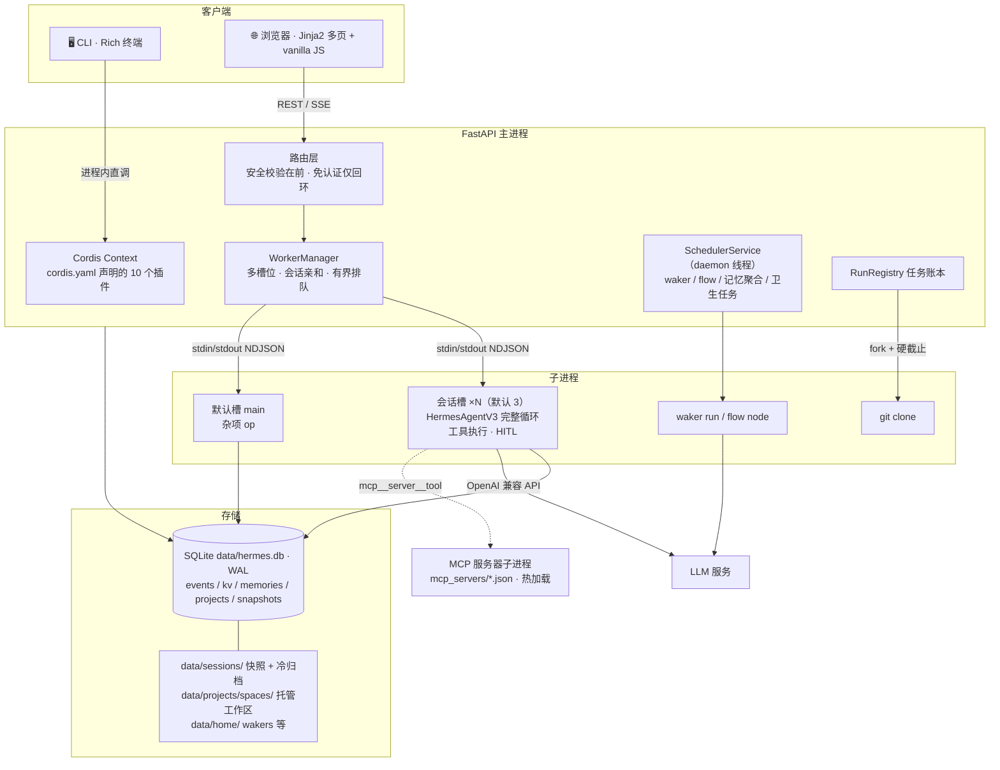
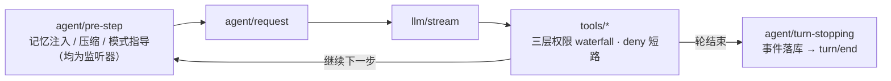

# ⚡ Hermes-Ma · Agent

[English](./README.en.md) | 简体中文

单用户 AI Agent 工作台：**以项目空间为中心组织你的对话与文件**——像 IDE 一样选择/新建/克隆项目，让 agent 真正在项目目录里干活；也可以免项目随手开聊。CLI 与 Web 双界面，同一个 V3 引擎。

- **项目空间**：最近项目卡片 / 新建托管空间 / 打开本地目录 / **克隆 Git 仓库** / 收件箱直聊——会话跟随项目，多项目并存
- **多标签页并行**：每个标签页独立会话**同时生成**互不阻塞（并发上限可配），停止按钮只停自己
- **只读文件树**：对话页右侧常驻当前项目目录树，点击预览；一切写入仍走对话工具流与 HITL 审批
- **免登录即用**：无账号体系，本机启动直接进入工作台（默认仅监听 127.0.0.1）
- **Cordis 插件架构**：模型/工具/记忆/调度/工作区全部是挂在共享 Context 上的插件（`cordis.yaml` 一张清单组合）
- **事件溯源会话**：模型看到的一切都可从事件日志重建——`/events` 查看完整轨迹、`/fork` 从任意事件点复制分支
- **三层权限 + HITL 审批**：destructive 操作先问人（full_access / before_changes / plan 三模式）
- **数字员工（Waker）与工作流（WakerFlow）**：定时任务、多 agent DAG 编排、审批节点、HTTP 外发
- **长期记忆**：SQLite 存储 + LLM 去重合并（Consolidation）+ 会话总结自动沉淀


## 🎬 Demo

Web 端「欢迎页选项目 → 对话 → 审批」的完整界面见下文各节截图；CLI 端一轮典型工作流如下（示意节选）——白名单内的只读命令免审批直接执行，写文件先弹 HITL 审批：

```text
$ python main.py
╭──────────────╮
│ ⚡ Hermes—Ma │
╰──────────────╯
  ✅ 系统初始化完成！
  🔧 生效工具 19 个 | 工作区: 已挂载（local）~/repos/flask-app

  👤 local: 统计 src/ 下 Python 代码行数，Top 10 写进 reports/loc.md

  + 🔧 bash ──────────────────────────────────────+
  | 📥 find src -name "*.py" | xargs wc -l | head |
  | ✅ 847 total ...                              |
  +───────────────────────────────────────────────+

  ╭─ 🔒 等待人工审批 ────────────────────────────╮
  │ 操作: bash                                   │
  │ 详情: mkdir -p reports && … > reports/loc.md │
  ╰──────────────────────────────────────────────╯
  请输入审批结果
    approve = 批准
    reject:原因 = 拒绝并附带原因
    其他任何输入 = 拒绝
  : approve
  ✅ 已批准执行 bash

  ╭─ 🤖 HermesMa ───────────────────────────────────────╮
  │ 已写入 reports/loc.md：共 847 行 Python，最重的三个 │
  │ 文件是 agent/agent_v3.py、tools/…（完整清单见文件） │
  ╰─────────────────────────────────────────────────────╯
```

跑起来见下文 [快速开始](#-快速开始)——`bash setup.sh` 一条命令到位，Web / CLI 二选一。

## 🚀 快速开始

### 方式一：一键脚本（推荐）

```bash
bash setup.sh          # 交互式：自动探测/创建环境（conda 或 venv）→ 幂等装依赖
                       # → 首次运行交互配置模型（含连通实测）+ 网络代理 → 问你启动 Web 还是 CLI
bash setup.sh web      # 跳过询问直接启动 Web
bash setup.sh cli      # 跳过询问直接启动 CLI
bash setup.sh --reconfig   # 重新配置模型三要素 + 网络代理
```

幂等可反复运行：已有 `hermes_ma` 环境/依赖/config.yaml 时全部跳过直接进入启动。

> **网络代理**：setup 会询问一次 HTTP 代理（写入 config.yaml 的 `web_proxy`）。
> DDG 搜索等境外 MCP 工具依赖它（自动作为子进程的 HTTP_PROXY/HTTPS_PROXY）；
> 可直连境外则留空。`HERMES_WEB_PROXY=... bash setup.sh` 可非交互预置。

> **换设备迁移**：克隆仓库 → `bash setup.sh` 一次到位。内置的 ddg-search MCP
> 随项目环境安装（requirements.txt），配置里的 `{PYTHON}` 占位符在运行时展开为
> 当前解释器，无需改任何绝对路径。

### 方式二：手动

#### 1. 安装

```bash
git clone <repo> && cd hermes_ma
pip install -r requirements.txt
# 或 pip install -e .（依赖清单已与 requirements.txt 对齐）
```

#### 2. 配置

```bash
cp config.example.yaml config.yaml
# 编辑 config.yaml：填入 openai_api_key / openai_base_url / llm_model_name
# 环境变量（大写下划线）可覆盖 yaml 同名键；api_key 也可用 OPENAI_API_KEY
```

MCP 服务器：在 `mcp_servers/` 目录下每服务一个 `mcp_<name>.json`（Web 设置页也可添加，热加载）。
`command`/`args` 支持 `{PYTHON}`（当前解释器）与 `{PROJECT_ROOT}`（项目根）占位符，配置可跨设备复用；
MCP 子进程代理取 config.yaml 的 `web_proxy`，可用 `mcp_env` 键全局覆盖、单服务 `env` 最终覆盖。

### 3. 老数据迁移（从旧版本升级必须执行一次）

```bash
python scripts/migrate_to_sqlite.py --dry-run   # 先看计划
python scripts/migrate_to_sqlite.py             # 执行（幂等；旧 users/<uid>/ 拍平进 data/home/，
                                                # profile.md 记忆入 SQLite，多旧用户目录时加 --user <uid>）
```

### 4. 启动

```bash
# Web 模式（推荐）
python -m web_fastapi.main
# 默认 http://127.0.0.1:8000 —— 免登录，打开即是欢迎页

# CLI 模式（Rich 终端交互，同一引擎）
python main.py
```

> ⚠️ **免认证声明**：应用没有任何访问控制（无账号/密码/token）。默认仅监听 127.0.0.1，任何能访问该端口的程序/人都等同持有完整 Agent 能力（文件/Shell）。设 `WEB_HOST=0.0.0.0` 暴露局域网时会打印显著警告——**除非完全可信且自行加了反向代理鉴权，否则不要暴露**（更不要挂公网隧道）。

## 🌐 Web 使用

### 欢迎页：项目空间选择器

打开首页即见。四个入口对应真实工作流的四种开始方式：

| 入口 | 行为 |
|------|------|
| 💬 **直接开聊** | 进入内建「收件箱」：免项目的随手对话，历史都在这里 |
| 📂 **打开本地目录** | 挂载本机绝对路径为项目（拒绝系统目录/hermes 数据区/junction；挂载后 agent 工具以它为根） |
| ⬇ **克隆 Git 仓库** | 输入 https 地址，后台子进程克隆进托管区；完成后卡片自动出现，失败原因在卡片徽标可查 |
| ＋ **新建空间** | 在 `data/projects/spaces/<slug>/` 创建托管目录 |

卡片按最近打开排序；点击即进入该项目上下文的对话页。会话跟随项目：每个标签页记住自己正在用的会话，**可以开多个标签页同时与不同会话对话**（并行生成数上限 `web_max_parallel_sessions`，默认 3，超限友好提示）。

### 对话页

- 左侧会话列表（仅显示当前项目的会话）+ 流式回复 + 工具调用面板 + 折叠推理 + 图片粘贴/拖拽
- **右侧只读文件树**：懒加载浏览当前项目目录，点文件弹出只读预览（二进制/超大文件友好降级）；增删改一律回到对话里让 agent 干，照旧走权限与 HITL
- **⏹ 停止按钮**：真实中断当前生成，且只停本标签页的会话
- **HITL 审批弹层**：destructive 工具执行前弹出操作详情，批准/拒绝（可附原因）
- 权限模式切换、会话级 waker 人格切换、todos 实时小窗、自动压缩提示
- 全站危险操作（删会话/删项目/清记忆/删 Waker…）统一走**自定义确认弹层**，操作反馈用 toast——没有原生 alert/confirm


右侧文件树（浏览 + 点击预览；写入仍走对话工具流）：


destructive 操作先弹出完整参数详情，批准 / 拒绝（HITL）：


删除类操作的确认弹层（uiConfirm 组件，替代原生 confirm）：


> ⚠️ **安全边界（如实声明）**：无 OS 级沙箱。约束 = 工具层路径守卫 + 三层权限（destructive 操作走 HITL 审批）+ shell 白名单收紧。bash 仅 cwd 锚定在项目根，理论上可 `cd` 逃逸——重要数据请配合 `before_changes`（默认）或 `plan` 模式使用。

### 会话管理（对话页侧栏内建）

历史会话都在对话页左栏：每条支持 **✏️ 重命名 / 🗑 删除**，以及「⋯」菜单——

- **📋 复制分支**：从当前会话 fork 出新会话继续，自动继承项目归属
- **📜 事件流**：该会话的全部持久事件（turn/user/assistant/tool/interrupt/compact…，含 HITL 审批恢复轨迹）
- **📝 生成总结**：按需把会话沉淀为记忆


### 其他页面

- 🧠 **记忆**：查看/清除/LLM 聚合（合并去重，带快照备份与恢复）

  
- ⚙️ **设置**：偏好（热生效）+ 系统配置（掩码密钥不会被回写覆盖）+ 模型档案 + MCP 管理 + 运行统计 + 健康自检（显示版本与代码目录）

  

  运行统计快照（会话/LLM 错误/存储行数/数字员工概览）：

  
- 📊 **用量**：LLM token 记账与看板——时间窗与模型筛选、按日堆叠趋势（实色=输入·浅色=输出）、按场景合计（对话/Waker/Flow）、逐次调用明细（含工具/耗时/详情留底）

  
- ⏰ **Waker** / 🔀 **WakerFlow**：数字员工与工作流管理（见下文专章）

## 📖 CLI 使用

```bash
python main.py
```

单用户（身份恒 `local`），启动横幅会显示**实际生效的工具数与工作区模式**。

| 命令 | 说明 |
|------|------|
| `/project` | 项目空间：列表 / `switch <slug>` 切换 / `new <名称>` 新建 / `off` 回收件箱（与 Web 共享激活状态） |
| `/events [条数]` | 查看当前会话的事件溯源轨迹 |
| `/fork [事件ID]` | 复制当前会话为分支（可按事件 id 截断）并切换过去 |
| `/think [on\|off]` | 开/关思考模式（与 Web 推理开关对齐） |
| `/waker [list\|run <名>]` | 数字员工：列表 / 立即执行一轮任务 |
| `/flow [list\|run <名>]` | WakerFlow：列表 / 运行一次工作流 |
| `/mode` | 查看/切换权限模式（full_access / before_changes / plan） |
| `/resume` `/resume <id>` `/resume -a` | 恢复历史会话（waker 人格绑定随会话恢复） |
| `/rename <名称>` `/save` | 重命名 / 手动保存当前会话 |
| `/tools` `/skill` `/mcp` | 生效工具 / 技能列表 / MCP 服务器管理 |
| `/memory` `/clear` | 查看 / 清除长期记忆 |
| `/compact` `/reset` | 手动压缩历史 / 重置会话（todos/工作区状态一并清） |
| `/help` `/exit` | 帮助 / 退出（可选生成会话总结沉淀记忆） |

- **HITL 审批**：终端弹操作详情，输入 `approve` 批准、`reject:原因` 或任意其他文本拒绝（**空回车默认拒绝**）
- **Ctrl+C**：中断当前生成，已生成内容与你的提问会保留进会话历史

## 🏗️ 架构

### 总体拓扑


```mermaid
flowchart TB
    subgraph FE["客户端"]
        CLI["🖥 CLI · Rich 终端"]
        WEB["🌐 浏览器 · Jinja2 多页 + vanilla JS"]
    end

    CLI -->|"进程内直调"| CTX
    WEB -->|"REST / SSE"| API

    subgraph MAIN["FastAPI 主进程"]
        API["路由层<br/>安全校验在前 · 免认证仅回环"]
        CTX["Cordis Context<br/>cordis.yaml 声明的 10 个插件"]
        WM["WorkerManager<br/>多槽位 · 会话亲和 · 有界排队"]
        SCHED["SchedulerService（daemon 线程）<br/>waker / flow / 记忆聚合 / 卫生任务"]
        RR["RunRegistry 任务账本"]
    end

    API --> WM
    SCHED --> T1
    RR -->|"fork + 硬截止"| T2

    subgraph SUB["子进程"]
        W1["默认槽 main<br/>杂项 op"]
        W2["会话槽 ×N（默认 3）<br/>HermesAgentV3 完整循环<br/>工具执行 · HITL"]
        T1["waker run / flow node"]
        T2["git clone"]
    end

    WM -->|"stdin/stdout NDJSON"| W1
    WM -->|"stdin/stdout NDJSON"| W2
    W2 -.->|"mcp__server__tool"| MCP["MCP 服务器子进程<br/>mcp_servers/*.json · 热加载"]
    W2 -->|"OpenAI 兼容 API"| LLM["LLM 服务"]
    T1 --> LLM

    subgraph STORE["存储"]
        DB[("SQLite data/hermes.db · WAL<br/>events / kv / memories / projects / snapshots")]
        FS["data/sessions/ 快照 + 冷归档<br/>data/projects/spaces/ 托管工作区<br/>data/home/ wakers 等"]
    end

    MAIN --> DB
    W1 --> DB
    W2 --> DB
    DB --- FS
```

### Cordis 插件内核（Python 版）

按 DeepSeek Harness 的 Cordis 元框架模式实现（`src/cordis/`）：**一切能力皆插件**，挂在共享 Context 上，`cordis.yaml` 一张清单声明组合：

```yaml
plugins:
  - {id: config,    plugin: "src.plugins.config_plugin:apply"}
  - {id: storage,   plugin: "src.plugins.storage_plugin:apply"}
  - {id: sessions,  plugin: "src.plugins.sessions_plugin:apply", inject: [storage]}
  - {id: memory,    plugin: "src.plugins.memory_plugin:apply",   inject: [storage]}
  - {id: llm,       plugin: "src.plugins.llm_plugin:apply",      inject: [config]}
  - {id: tools,     plugin: "src.plugins.tools_plugin:apply",    inject: [config]}
  - {id: skills,    plugin: "src.plugins.skills_plugin:apply",   inject: [config]}
  - {id: mcp,       plugin: "src.plugins.mcp_plugin:apply"}
  - {id: workspace, plugin: "src.plugins.workspace_plugin:apply", inject: [storage]}
  - {id: schedule,  plugin: "src.plugins.scheduler_plugin:apply", inject: [config]}
```

核心机制：**Context = 服务仓库**（`ctx.tools` / `ctx.llm` 稳定键）；**inject 声明依赖**（加载顺序自动推导）；**类型化事件**（emit/waterfall/parallel/serial 四种分发，权限决策是 `tools/pre-execute` waterfall 监听器——deny 即短路）；**注册皆可逆**（teardown LIFO 回滚）；**作用域**（waker run 用 `ctx.scope()` 做工具白名单，取代旧 monkey-patch）。

Agent 循环本身也是事件化的：`agent/pre-step`（记忆注入/压缩/模式指导是监听器）→ `agent/request` → `llm/stream` → `tools/*` → `agent/turn-stopping`。


```mermaid
flowchart LR
    A["agent/pre-step<br/>记忆注入 / 压缩 / 模式指导（均为监听器）"] --> B["agent/request"]
    B --> C["llm/stream"]
    C --> D["tools/*<br/>三层权限 waterfall · deny 短路"]
    D -->|"继续下一步"| A
    D -->|"轮结束"| E["agent/turn-stopping<br/>事件落库 → turn/end"]
```

### 事件溯源会话

每轮对话写入 append-only 事件日志（SQLite `events` 表）：`turn/start`、`user/message`、`assistant/message`（含完整 tool_calls）、`tool/call|result`、`interrupt/requested|resolved`（HITL 中断快照——**worker 重启后待审批操作可恢复**）、`compact/applied`（带压缩保留区）、`turn/end`。

**不变量**：`derive_messages()` 投影 == 实际发给 LLM 的消息（"模型可见即可从日志重建"，有测试锁定）。会话加载事件优先，旧 JSON 快照兼容回退。HITL 悬空 tool_calls 在投影时自动合成占位。

**会话状态与冷归档**：todos / virtual_fs / waker 的权威源是 SQLite kv（scope=`session_state`，每会话一行），JSON 快照降级为列表预览缓存（可丢可重建，旧会话读取时自动回填迁移）；卫生任务会把最后一条 `compact/applied` 之前的事件归档到会话旁 `.events-archive.jsonl`（投影语义不变，事件对话框 / fork / `/events` 走冷热合并读）。

### 存储与目录

SQLite 单库 `data/hermes.db`（WAL，跨进程安全）：`memories` / `events` / `kv`（项目激活指针、挂载状态、任务账本、运行登记表、会话状态 todos/vfs/waker）/ `snapshots`（聚合备份，滚动保留 10 份）+ `projects`（项目空间表，schema v2）。

```
data/
  hermes.db        # SQLite（上述数据）
  sessions/        # 会话 JSON 快照（列表/预览缓存；消息真源=事件流，todos/vfs/waker 真源=kv；*.events-archive.jsonl 为事件冷归档）
  projects/spaces/ # 托管型项目的工作区目录（git clone / 新建空间落这里）
  summaries/       # 会话总结 markdown
  uploads/         # 聊天图片
  home/            # agent 家目录（未挂载时 fs 工具的根）
    wakers/ wakerflows/ ...
```

### 进程模型（多槽位）

FastAPI 主进程（cordis ctx + 统一调度 + 任务账本 + 列表等直读）＋ **按会话亲和的 worker 槽位**：默认槽 `main` 承载杂项 op；每个"正在生成"的会话一个专属 worker 子进程（stdin/stdout NDJSON，跑完整 agent），互不抢锁——这是多标签页并行的机制；上限 `web_max_parallel_sessions`（默认 3），超限立即友好提示。waker/flow 节点与 git 克隆按需 fork 独立子进程，与前台对话互不阻塞。

### 安全模型

1. **路径守卫**：所有 fs 工具经 `resolve_under_root`（realpath 包含检查），挂载根一致性校验（junction 换根防御）
2. **三层权限**：Layer3 参数级 evaluator/正则覆盖（force_deny 硬底线）→ Layer2 模式判定 → 工具执行
3. **HITL 审批**：destructive 操作中断等人；子 agent 继承父级权限模式与白名单（无绕过路径）
4. **Shell 收紧**：白名单命令 + 任何重定向/写文件形态 → 需审批；黑名单含 Windows 路径形态
5. **Web 边界**：**免认证**——默认仅绑定 127.0.0.1，非回环监听打印显著警告；无任何 API 鉴权，不要暴露到不可信网络

## 🧑‍💼 数字员工（Waker）

waker = 独立人格 + 配置 + 调度规则。到点或被 API 触发时跑完整一轮 agent 任务，结果落 `latest_result.md` + `runs/<run_id>.jsonl` 事件流。存储：`data/home/wakers/<name>/`。


### waker.yaml 配置

目录含三段人格 md（IDENTITY/PERSONA/BIBLE，按序组装注入 system prompt）+ `waker.yaml`（`config:` 用户可改 / `state:` 调度器回写，分节持久化互不干扰）。

**`config:` 主要字段**：

| 字段 | 默认 | 说明 |
|------|------|------|
| `enabled` | false | 启用调度 |
| `tools` | [] | 工具白名单（**空=全部**；作用域化实现，经 resolve 过滤含 MCP） |
| `permission_mode` | before_changes | full_access / before_changes / plan |
| `task_prompt` | "" | 自动任务描述（检查范围/步骤/输出位置/成功标准） |
| `schedule_type` | interval | interval / daily / none（`interval_minutes`、`daily_at`） |
| `api_enabled` + `api_token` | false | API 触发（token 创建时生成，仅返回一次明文） |
| `max_runs` / `expire_at` | 0 / "" | 次数上限 / 过期时间（0=不限） |

**`state:`**：`run_count` / `last_run_at` / `last_status` / `next_run_at`（调度落后于计划时，列表卡片会显示「⏰ 调度延迟中」徽章）。

创建/编辑表单：IDENTITY / PERSONA / BIBLE 三段人格按序组装进 system prompt：


「📜 运行记录」抽屉：每次运行的状态/耗时/事件流与最终总结，点开即查：


### 执行

- 统一调度服务（`ctx.schedule`，单 daemon 线程托管 waker/flow/记忆聚合等注册项）到期提交
- 执行走**独立子进程**（`worker_node`），不碰 chat 的执行实例；工具白名单/权限模式以 `stream_invoke(allowed_tools=...)` 作用域传递
- 无人值守遇审批：`before_changes` 下会自动拒绝并记录（写 interrupt/resolved 事件）；全自动请用 `full_access`，或用 WakerFlow 的 `ask_user` 把审批点显式化

## 🧩 WakerFlow 工作流编排

YAML 声明的 DAG：顶层顺序 `steps`，每步可嵌套。单 waker 是 WakerFlow 的退化。


Web 编辑器是拖拽积木面（worker/parallel/pipeline/ask_user/action），无需写 YAML，并可一键与 YAML 互转：


```yaml
name: repo_inspect
inputs:
  repo_path: {type: string, required: true}
steps:
  - id: scan
    worker: code_scanner
    task: 扫描 {{inputs.repo_path}}，列出技术栈与可疑依赖
  - id: analyze
    parallel:
      - {id: research, worker: tech_researcher, task: 针对 {{steps.scan.result}} 调研}
      - {id: critique, worker: critic, task: 找出 {{steps.scan.result}} 风险}
  - id: ask_route
    if: inputs.mode == "deep"
    ask_user: {question: 是否继续深入？, options: [...], default: report, timeout: 3600}
  - id: notify
    action: {method: POST, url: https://hooks.example/x, body: {repo: "{{inputs.repo_path}}"}}
returns:
  summary: "{{steps.analyze.sub_results.research.result}}"
```

| 节点 | 语义 |
|------|------|
| `worker` | fork 子进程跑 waker 人格的完整 agent，取最终文本 |
| `parallel` | 子步骤并发（共享 context 快照），`sub_results` 汇总 |
| `pipeline` | 串行，上游 result 进 context 供下游 `{{steps.x.result}}` |
| `ask_user` | 审批文件落盘 + 轮询（Web 审批页回答）；超时用 `default` |
| `action` | HTTP 外发（2xx→ok） |

- **模板**：`{{inputs.x}}` / `{{steps.y.result}}` / `{{steps.父.子.result}}`（缺失键报错不静默）
- **`if`**：ast 白名单安全求值（GitHub Actions 语义），失败默认 True
- **YAML 导入/导出**：Web 编辑器一键互转（非持久化转换端点）
- **审计**：`runs/<run_id>.jsonl` 全事件；运行登记表入 SQLite（重启可见，running→interrupted）

## ⚖️ CLI vs Web

| 维度 | CLI | Web |
|------|-----|-----|
| 引擎 | HermesAgentV3（同一引擎） | HermesAgentV3 |
| 项目/工作区 | `/project` 切换/新建/收件箱（与 Web 共享激活状态；横幅如实显示） | 欢迎页项目选择器 + 右侧文件树 |
| 并行会话 | 单会话 | 多标签页并行（上限可配） |
| HITL 审批 | 终端提示（空回车=拒绝） | 弹层批准/拒绝 |
| 权限模式 | `/mode` | 顶栏切换（多实例同步生效） |
| 思考模式 | `/think on\|off` | 推理 chip |
| 会话轨迹 | `/events` 事件流 + `/fork` 分支（同一事件溯源） | 事件流 + fork + 页面管理 |
| waker/wakerflow | `/waker` `/flow`（列表 + 运行；CRUD 经配置文件或 Web） | 独立管理页（CRUD/触发/审批/积木编辑器） |
| MCP | `/mcp` 菜单 | 设置页热加载 |

## 🧰 工具面（16 内置 + 动态 MCP）

| 类 | 工具 |
|----|------|
| 文件 / Shell | `bash`（唯一文件通道；cwd 锚定项目根；按需加载 `file-ops` 技能。白名单只读零审批，`sed -i` / 重定向等写形态弹审批。无 OS 级路径沙箱：白名单命令可静默读工作区外路径，约束=分类+审批+提示词） |
| 编排 | `task`（子 agent，继承权限与白名单）`compact_conversation` `write_todos` |
| 知识 | `web_fetch` `web_search` `use_skill` `remember` `request_human_approval` |
| 管理 | `list_wakers` `create_waker` `set_waker_enabled` `create_wakerflow`；`list_mcps` `create_mcp` `remove_mcp` |
| MCP | `mcp__<server>__<tool>`（`mcp_servers/` 声明或 chat 内 `create_mcp` 接入，热加载；收件箱经 `mcp__*` 通配可见，`trust=approval` 下调用仍弹审批） |

收件箱（免项目）模式默认保留待办/压缩 + waker/MCP 管理面 + `web_fetch`/`web_search`/`use_skill` + 已连接 MCP 工具（可经 `workspace_chat_only_tools` 配置）。

**自进化三件套**（`self_backup` / `verify_self` / `respawn_self`）：出厂默认**不注入**——设置页开关 `self_evolve_enabled` 开启后下一轮对话生效（与 `shell_enabled` 同款门控链路）；写仓库路径必审批的 force_approval 护栏与开关无关、始终生效。

## 📁 项目结构（核心）

```
hermes_ma/
├── main.py / src/cli/             # CLI 入口（Rich；commands/render/chat_loop/entry 分包）
├── web_fastapi/                   # Web：app 工厂 + 多槽 worker（process/ops/state 分模块）+ 路由 + services 服务层 + 模板/JS
├── cordis.yaml                    # 插件组合清单（10 行 = 整个系统的能力面）
├── config.yaml                    # LLM/端口等（环境变量可覆盖）
├── src/
│   ├── cordis/                    # 插件内核（Context/事件/inject 加载器）
│   ├── types/                     # 跨包公共类型（ToolResult/ToolSpec/PermissionDecision/InterruptSignal）
│   ├── plugins/                   # 10 个插件 + boot_context 组合根
│   ├── agent/                     # HermesAgentV3（事件化 ReAct）+ SessionLog + HITL + 流消费/监听器
│   ├── tools/                     # ToolSpec/三层权限/路径守卫/16 工具执行器
│   ├── memory/                    # 记忆（提取/判定/聚合/调度；SQLite + sqlite-vec + fastembed）
│   ├── scheduling/                # 统一调度服务（waker/flow/记忆聚合/卫生任务的 daemon 线程）
│   ├── waker/ wakerflow/          # 数字员工 + DAG 编排
│   ├── workspace/                 # 挂载状态服务（校验矩阵/zip 防护）
│   ├── storage/                   # SQLite 接缝（三协议）+ projects/运行登记/卫生任务/会话状态 kv
│   ├── session_store.py           # 会话持久化（原子写/事件优先加载/项目归属）
│   └── ipc.py                     # 子进程 NDJSON 公共设施
├── tools/*.yaml                   # 16 个声明式工具定义（+3 个 self_evolve 工具，门控默认关）
├── skills/                        # 技能包目录（自行添加，格式见 skills/README.md）
├── scripts/                       # migrate_to_sqlite 老数据迁移 + legacy_memory_backend（文件后端已退役，仅供迁移）
└── docs/                          # adr/ + architecture.md + refactor-roadmap.md（治理路线图）等
```

## 🧪 测试

```bash
python -m pytest          # 2000+ 用例（内核/存储/agent 事件化/HITL 持久化/waker/flow/web API/安全/并行槽位/跨进程并发/IPC 契约/事件归档）
```

CI：GitHub Actions（`.github/workflows/ci.yml`）——ruff + 全量 pytest，push / PR 自动执行。

## 📚 更多文档

- `docs/architecture.md` — 架构一页汇总（拓扑图 / 决策表 / 风险清单 / 依赖纪律）
- `docs/refactor-roadmap.md` — 结构治理路线图（P0-P3 已完结；各项落点、不变量与顺延决策）
- `docs/adr/` — 关键架构决策记录（执行隔离 / 调度 / 任务账本 / 存储拓扑 / 项目空间模型）
- `docs/cordis/01-rollout.md` — 升级 / 迁移 / 双模式使用指南、已知事项与后续候选
- `docs/walkthrough/` — 代码走读（部分章节撰写于 Cordis 重构前，历史参考）
- `docs/v3/` — V3 架构系列（撰写于更早的 toolschema 分支时期，架构决策历史参考；项目现状以本 README 为准）

## 📄 License

[MIT](LICENSE)
